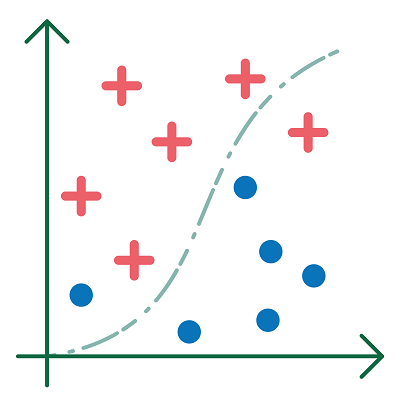

# Regression and Classification

**A machine learning system acquires knowledge from data using learning algorithms with the intention of being able to predict outcomes for new data.**

        <ul>Predicting based on trends is a <b>regression problem</b>.</ul>
        <ul>Predicting a class is a <b>classification problem</b>.</ul> 
Predicting means, for example, generating figures for the future from past trends (regression) or classifying an object into a certain category (called a class) (classification).

  
> **Concrete examples of regression:**  
> - predicting the price of an apartment or deciding (based on the prices of apartments that have already been sold); 
> - deducing the thickness of a mountain glacier in the coming years from its decrease over past decades.  

> **Concrete examples of classification:**  
> - determining whether an email is spam or not;  
> - being able to say from a photo whether there is a stoma present or not.

 
<figure>
    <figcaption align = "center">Regression.</figcaption>
</figure> 

 
<figure>
    <figcaption align = "center">Classification.</figcaption>
</figure> 

With machine learning, one can address problems of regression and classification. These techniques are presented in the learning paths ['Classification'](https://www.dwengo.org/learning-path.html?hruid=kiks5_classificatie&language=nl&te=true&source_page=%2Fkiks%2F&source_title=%20KIKS#kiks_mnist;nl;3) and ['Regression'](https://www.dwengo.org/learning-path.html?hruid=kiks6_regressie&language=nl&te=true&source_page=%2Fkiks%2F&source_title=%20KIKS#kiks_iris_regressie;nl;3).