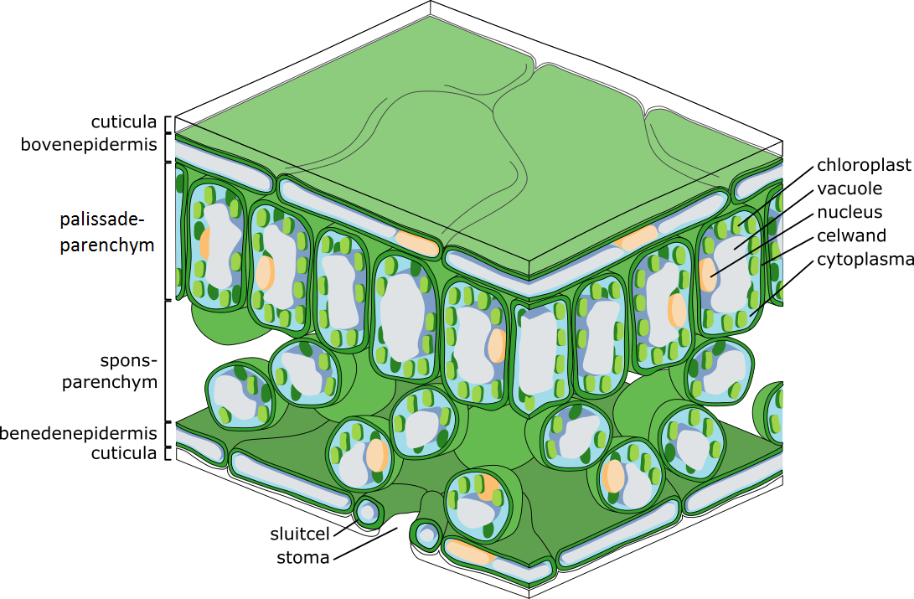
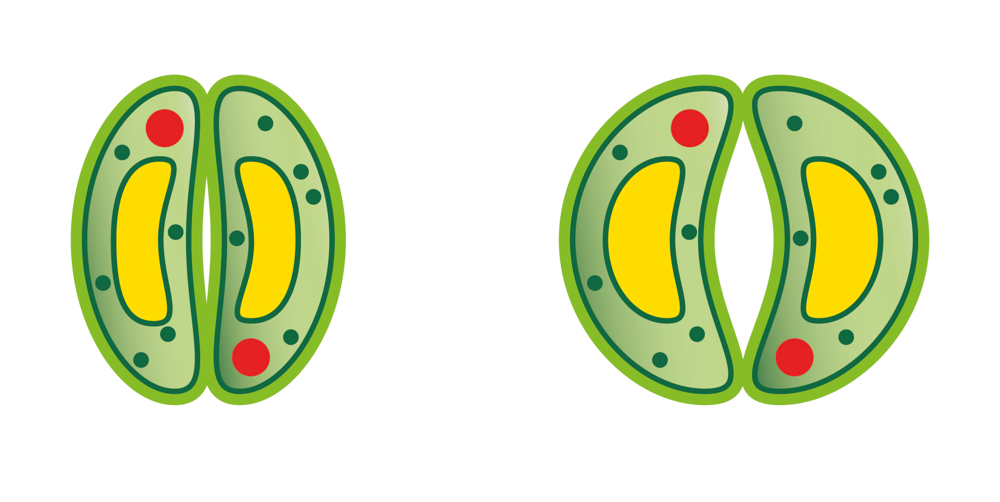
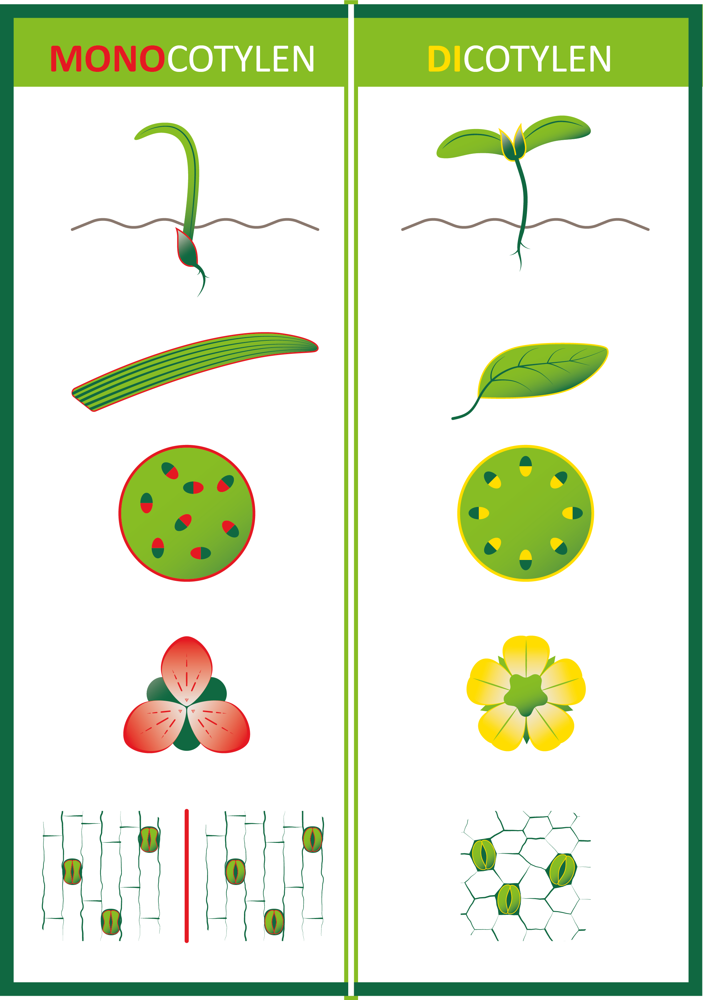

# Monocots and dicots

<figure>
    <figcaption align = "center">Figure 1: Leaf structure (Zephyris, 2011).</figcaption>
</figure>

A stomata lies between two guard cells (as seen on the leaf structure in Figure 1). When the guard cells increase in volume, the stomata opens. The guard cells increase in volume by absorbing water. The result is that the guard cells curve, causing the stomata to open (See Figure 2).

<figure>
    <figcaption align = "center">Figure 2: Closed and open stomata.</figcaption>
</figure>

**Stomata can occur on both sides of a leaf (amphistomatous), or on only one side, usually the underside (hypostomatous), exceptionally the top (epistomatous), e.g., in a water lily.** 
Stomata and the cuticle are seen as **key elements in the evolution of plants**. They ensure that plants can live in different and changing conditions without drying out (Hetherington & Woodward, 2003).

Stomata provide information about the plant's position in the phylogenetic tree of the flowering plants. Among the angiosperms or flowering plants, one distinguishes the **dicots** and the **monocots** (see Figure 3). The stomata of dicots are kidney-shaped, while those of monocots can be kidney-shaped or dumbbell-shaped, depending on the plant. The veins of monocots run parallel and their stomata too. The veins of dicots are branched and their stomata are randomly dispersed across the leaf.

<figure>
    <figcaption align = "center">Figure 3: Monocots and dicots.</figcaption>
</figure>

    <strong>Notebook Datatypes for listings</strong> 
    On the webpage https://dwengo.org/python/, you'll find the learning path <em>Datatypes</em>. In the notebook <em>1000_Listings.ipynb</em> of this learning path, monocots and dicots are discussed.

 

<strong>Video</strong> 

[Stomatal Closure in Tradescantia Leaf Cells.](https://youtu.be/AwyrqfNTuxQ "davcjal, 2015")  
[Monocot and Eudicot Germination Time-lapse.](https://youtu.be/WbG5zu2Vw0I "Sci- Inspi, 2018")

