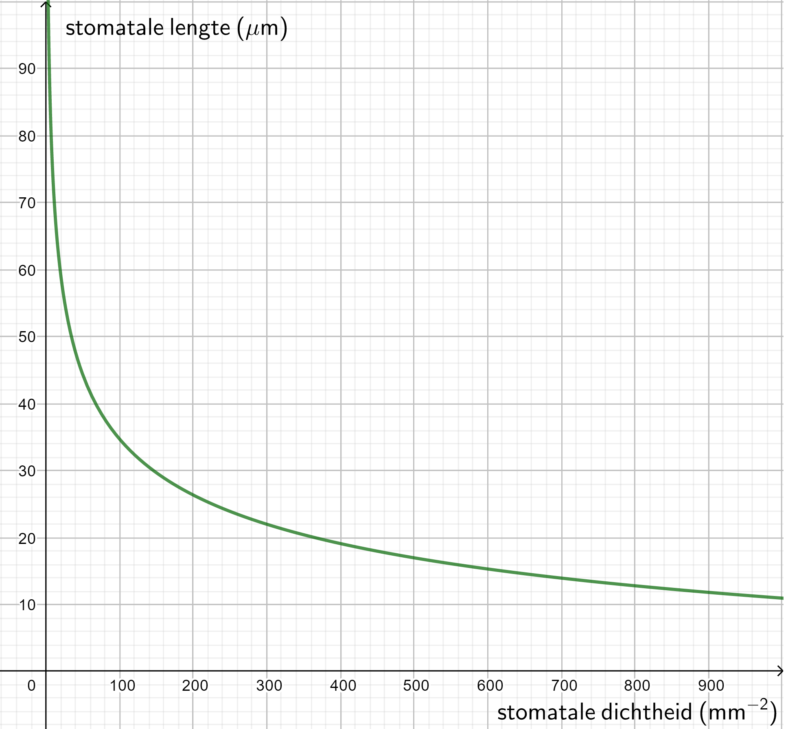

# Size of a Stoma
Depending on the type of plant and environmental factors, the size of a stoma and the number of stomata per unit area (the **stomatal density**) can vary. A stoma is between 10 and 100 micrometers long (comparable to the thickness of a human hair) and the density ranges from 5 to 1000 stomata per mm² of leaf surface area.

> A human hair is between 17 and 180 μm thick.

<figure>
    <figcaption align="center">Figure: The relationship between stomatal length (in μm) and stomatal density (in mm−2) is given by y = -28.75 + 162x-0.2036 (Hetherington & Woodward, 2003).</figcaption>
</figure>

**The size and density of the stomata can reveal various aspects of the environment in which a plant lived: temperature, atmosphere, CO2 concentration.** This is extensively used in a paleontological context to reconstruct the climate in which the plants grew.

A clear **relationship between the number of stomata and the size of the stomata** has been established for several plant families and fossil leaves. The graph shows that the more stomata there are per unit area, the shorter the guard cells and thus **the smaller the stomata** are (Hetherington & Woodward, 2003).

    <strong>Machine learning notebook - regression</strong> 
    At https://dwengo.org/kiks/ you can find 'Tree Height Stomata' in the 'Regression' learning pathway. The notebook <em>0200_TreeHeightStomata.ipynb</em> investigates whether the height of a tree is related to the size of the stomata.

    <strong>Notebook functions</strong> 
    At https://dwengo.org/python you can find the 'Functions and Classes' learning pathway. In the section 'Combination exercises', the notebook <em>0100_FunctionsExtraExercises.ipynb</em> includes an exercise on the size of a stoma.

