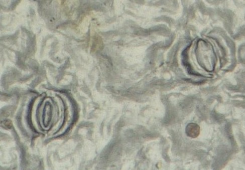

# Opening and Closing of Stomata 

A plant is constantly seeking a balance between moisture loss and CO2 uptake, depending on the plant's moisture status, humidity, light, and CO2 concentration. All these factors, along with the plant’s biological clock, determine if and to what extent the stomata are open.

Stomata are subject to rhythms such as day and night and the seasons.

It is clear that the stomata 'respond' to **environmental factors**. In the same plant, one can sometimes see the difference between leaves at the bottom of the plant, which are much shaded, and leaves in the crown that are much more exposed to light. Even on the same leaf, stomata can behave differently, because this can be beneficial for the plant; on the same leaf, some stomata can be open while others are closed (see Figure).

<figure>
    <figcaption align = "center">Figure: Open and closed stomata on the same leaf.</figcaption>
</figure>