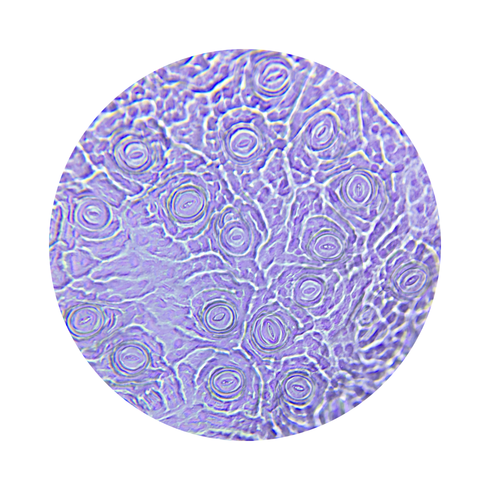

# Microscopy

No one has ever seen stomata with the naked eye. You can admire stomata with a **microscope**. That's a great experience, because you can also **photograph** stomata through the microscope with a smartphone. For instance, you can use a monocular microscope that magnifies 400 times. 
When you look at **living** material through the microscope, you will see beautiful images (see Figure 1). For this, you need to succeed in removing a piece of the very thin cuticle of the leaf. In some plants, this does not work very well, for example, due to the rigidity of the leaf.

<figure>
    <figcaption align = "center">Figure 1: Microphoto of living material.</figcaption>
</figure>

You can compensate for this by using the same method as the researchers from the Botanic Garden Meise, namely taking an **imprint** of the leaf with transparent nail polish (Figure 2).

<figure>
    <figcaption align = "center">Figure 2: Taking a leaf imprint with nail polish and adhesive tape.</figcaption>
</figure>

The photos are then not as nicely colored, but greyish (see Figure 3). But all in all, it still produces beautiful images; nature at its best.

<figure>
    <figcaption align = "center">Figure 3: Microphoto of live material.</figcaption>
</figure>

By choosing varied plants, you also get a **variation** in the images: monocots and dicots, large and small stomata, stomata of different shapes ...

***Through a laboratory exercise, you can verify the shape and location of stomata in monocots and dicots.*** 
***Through a laboratory exercise, you can also study the effect of sun and shade. Formulate a research question and a hypothesis here. After the lab, you refer back to the hypothesis.***  
***Through a laboratory exercise, you can also study the effect of the seasons. Formulate a research question and a hypothesis here. After the lab, you refer back to the hypothesis.***

    <strong>Lab - microscopy (stomata)</strong> 
    <ul><li>Gather fully grown leaves from plants with parallel veins and from plants with non-parallel veins.</li></ul>
    <ul><li>Optionally, collect leaves that receive a lot of light and leaves at the bottom of the plant, leaves from a shrub in the sun and from the same shrub in the shade.</li></ul>
    <ul><li>Try to remove a part of the very thin cuticle with a knife. Apply it to a slide with a drop of water and cover it with a cover slip.</li></ul>
    <ul><li>If this does not work due to the texture of the leaf, then take a nail polish imprint of the leaf. Apply the imprint with adhesive tape to a slide.</li></ul>
    <ul><li>Note whether you have used the underside or the top of the leaf.</li></ul>
    <ul><li>Note when and where you plucked the leaf: season, sun, shadow ...</li></ul>
    <ul><li>Record the name of the plant.</li></ul>
    <ul><li>Note whether it is a monocot or dicot.</li></ul>
    <ul><li>Examine the specimen under the microscope.</li></ul>
    <ul><li>Record what you see: many or few stomata, large or small stomata, what shape they have, how they are arranged ...</li></ul>

