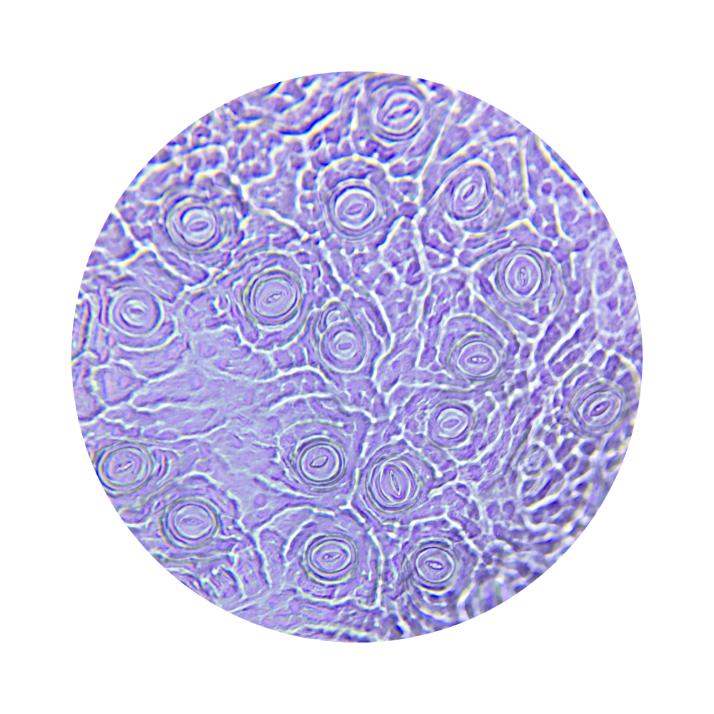
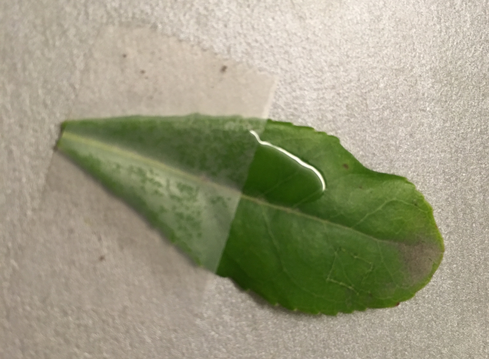

# Microscopy

No one has ever seen stomata with the naked eye. However, you can see them using a **microscope**. This is a great experience, because you can also **photograph** stomata through a microscope using a smartphone. For instance, you can use a monocular microscope that magnifies 400 times. 
When you look at **living** material through the microscope, you will see beautiful images (see Figure 1). For this, you need to remove a piece of the very thin cuticle of the leaf. In some plants, this does not work very well, for example, because of the rigidity of the leaf.

<figure>
    <figcaption align = "center">Figure 1: Microphoto of living material.</figcaption>
</figure>

You can compensate for this by using the same method as the researchers from the Botanic Garden Meise: taking an **imprint** of the leaf using transparent nail polish (Figure 2).

<figure>
    <figcaption align = "center">Figure 2: Taking a leaf imprint with nail polish and adhesive tape.</figcaption>
</figure>

The photos taken using imprints are greyish, rather than colored (see Figure 3). However, this process still produces beautiful images: nature at its best.

<figure>
    <figcaption align = "center">Figure 3: Microphoto of live material.</figcaption>
</figure>

By choosing a range of different plants, you will also get a **variation** in the images. For example, you can see the difference between monocotyledons (monocots) and dicotyledons (dicots), and distinguish large and small stomata, or stomata of different shapes.

***Through a laboratory exercise, you can verify the shape and location of stomata in monocots and dicots.*** 
***Through a laboratory exercise, you can also study the effect of sun and shade. Formulate a research question and a hypothesis here. After the lab work, you will refer back to the hypothesis.***  
***Through a laboratory exercise, you can also study the effect of the seasons. Formulate a research question and a hypothesis here. After the lab work, you will refer back to the hypothesis.***

    <strong>Lab - microscopy (stomata)</strong> 
    <ul><li>Gather fully grown leaves from plants with parallel and non-parallel veins.</li></ul>
    <ul><li>Optionally, collect leaves that receive a lot of light and leaves from the bottom of the plant, or leaves from a shrub in the sun and the same shrub in the shade.</li></ul>
    <ul><li>Try to remove a part of the very thin cuticle with a knife. Apply it to a slide with a drop of water and cover it with a cover slip.</li></ul>
    <ul><li>If the texture of the leaf means this does not work, take a nail polish imprint of the leaf. Apply the imprint to a slide using adhesive tape.</li></ul>
    <ul><li>Note whether you have used the underside or the top of the leaf.</li></ul>
    <ul><li>Note when and where you picked the leaf, including the season, and whether the plant or leaf was in sun or shade.</li></ul>
    <ul><li>Record the name of the plant.</li></ul>
    <ul><li>Note whether it is a monocotyledon or dicotyledon.</li></ul>
    <ul><li>Examine the specimen under the microscope.</li></ul>
    <ul><li>Record what you see: are there many or few stomata, are they large or small, what shape are the stomata, and how are they arranged?</li></ul>

