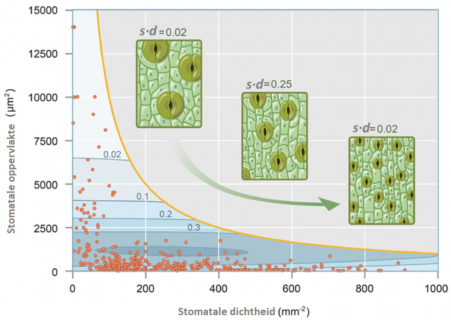
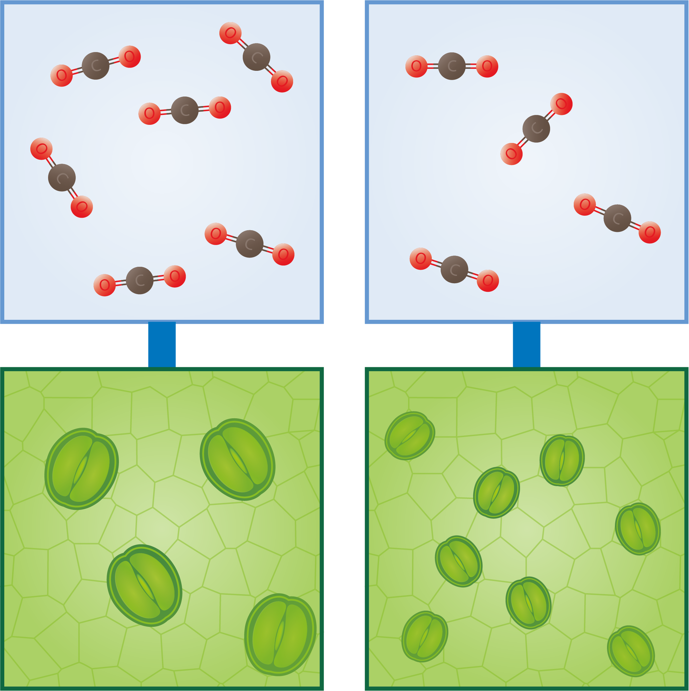

# Evolution of plants and their stomata 
**Fossil leaves provide a lot of information about the evolution of plants and their stomata.** Stomata first appeared in plants four hundred million years ago. Since then, they have evolved: noticeable changes have occurred, including differences in size and density of the stomata (see Figure 1) (Hetherington & Woodward, 2003). In particular, **many plants have evolved in such a way that the leaf area occupied by stomata (stomatal density) is as small as possible** (Assouline & Or, 2013; Franks & Beerling, 2009).

 
<figure>
    <figcaption align = "center">Figure 1: Fossil record-based plant leaf stomatal size (<em>s</em>) and density (<em>d</em>). When there are more stomata per unit area, the stomata are smaller. Plants have evolved so that the leaf area taken up by stomata (<em>s.d</em>) is as small as possible (Assouline & Or, 2013). Based on Franks & Beerling, 2009.</figcaption>
</figure>

**At low CO2 concentration, plants with many stomata are at an advantage and therefore prevalent. When there is a lot of CO2 in the atmosphere, plants with fewer stomata are at an advantage and they will be more common** (Thanukos, 2018). This is shown in Figure 2.

<figure>
    <figcaption align = "center">Figure 2: Relationship between the number and size of stomata and the CO2 concentration.</figcaption>
</figure>

**Fossil plant material shows that plants respond to long-term changes in CO2 by adjusting the density of their stomata.** Apart from photosynthesis, transpiration and water management of the plants also play a role (Franks & Beerling, 2009; de Boer et al., 2016).

**The amount of CO2 in the atmosphere can therefore be derived from measures of stomatal density. Since CO2 levels have a direct effect on global temperatures, changes in CO2 levels also provide a clear picture of changes in the climate.** (Assouline & Or, 2013; Franks & Beerling, 2009).

<strong>C3, C4, and CAM (optional)</strong> 

Evolution in the plant kingdom has resulted in three types of plants: C3, C4 and Crassulacean acid metabolism (CAM) plants. The photosynthesis process is different in each of these types. In warm areas, C3 plants tend to favor respiration at the expense of photosynthesis. C4 and CAM plants have adapted their photosynthesis processes to counter this. 
<ul><li>Approximately 85% of plant species are C3 plants, including grains and vegetables (e.g. rice, wheat, spinach, tomatoes) and all trees (e.g. apple trees, oak). They form molecules with three carbon atoms during the photosynthesis process.</li></ul> 
<ul><li>Approximately 5% of plant species are C4 plants, including corn, millet, sugarcane, and many grasses. They make up 25% of the plants on earth and are particularly common in tropical, often arid areas. They form molecules with four carbon atoms during the photosynthesis process.</li></ul> 
<ul><li>The remaining 10% of plant species are CAM plants, including cactus, pineapple, Kalanchoë, and sedum. They tend to be found in arid areas with high daytime temperatures and low nighttime temperatures. They also form molecules with four carbon atoms during the photosynthesis process, but they differ from C4 plants because they open their stomata at night to take in CO2. This protects them from dehydration. The CO2 is stored in the plant and made available during the day when the necessary light energy is present for photosynthesis. (Yamori et al., 2013; Sterrenwacht Armand Pien, 2018).</li></ul>

For the KIKS project, knowledge of C3, C4, and CAM plants is optional.

    <strong>Notebook Datatypes on enumerations</strong> 
    Via the webpage <a href="https://dwengo.org/python/">Programming in Python</a> you can find 'Enumerations' in the learning path <em>Datatypes</em>. The notebook <em>1000_Enumerations.ipynb</em> in this learning path discusses C3, C4, and CAM plants.  

