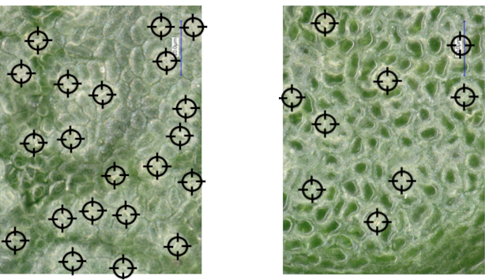

# Influence of the environment on the formation of stomata
**Experiments confirm that density and size can change through genetic adaptations, as well as through changes in environmental factors.** This means that variations can occur between plant species, between individual specimens of the same species, and between leaves of the same plant. Examples of change in environmental factors:

<ul><li>In specimens of the same species, but growing in different conditions (i.e., in the shade or in the sun), variations can occur in stomatal density. In a study on crabwood (Carapa) in the Amazon forest, the stomatal density was greater in the sun-exposed plants (Camargo & Marenco, 2012).</li></ul>

<ul><li>In the same plant, the number of stomata on shaded leaves at the bottom of the plant can differ from the number of stomata on leaves in the canopy that are much more exposed to light. This was observed by Sofie Meeus on the Monodora angolensis in the Meise Botanic Garden, as shown in the figure.</li></ul>

<figure>
    <figcaption align = "center">Figure: Respectively sun-exposed and shaded leaf of <em>Monodora angolensis</em></figcaption>
</figure>

<strong>Machine Learning Notebook: Classification</strong> 

<ul><li>On the <a href="https://dwengo.org/kiks/">KIKS project page</a>, you will find the 'Classification' learning path, which includes the section 'Stomata sun-shade'. There, work through the notebook <em>0300_StomataZonSchaduwClassificatie.ipynb</em>. You do not yet need to understand everything in this notebook.  You will see that the plants that grew in the sun can be separated from the plants that grew in the shade, based solely on the measurements and the density of the stomata.</li></ul>
<ul><li>Notice that the neural network initially chooses a line completely at random and then adjusts it step by step until a desired separating line is found?</li></ul>

<strong>Notebook 'Color Images' (optional)</strong> 
<ul><li>On the <a href="https://dwengo.org/kiks/">KIKS project page</a>, in the 'Digital images' learning path, you'll find the section 'Color'. In the notebook <em>0200_AfbeeldingenKleur.ipynb</em>, these photos from Sofie Meeus and micro-photos from the Meise Botanic Garden are used.</li></ul>

