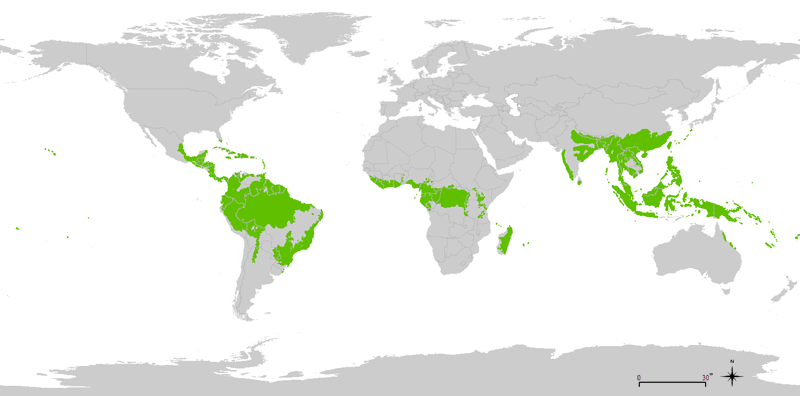

# Stomata and Climate Change 

**The water and CO2 cycles of the world are affected by the transpiration of terrestrial plants. Therefore, it can be said that stomata have a global impact, an impact on the entire world. Most transpiration by vegetation occurs in the warm forested regions of the tropics** (see Figure) (Hetherington & Woodward, 2003). The tropical rainforests are located in areas near the equator. They are found in Central and South America, Africa, Asia, and the islands around Australia. **It is important to understand how plants will adjust this transpiration to the current climate change.** Scientists are also researching how the current climate change is affecting the formation of stomata. 

 
<figure>
    <figcaption align = "center">Figure: The tropical rainforests are colored green on the map.</em></figcaption>
</figure> 

A changing climate impacts biodiversity, and conversely, **biodiversity** can also affect climate change. For example, transpiration not only cools the plant but also its environment. There are significant differences in how plants respond to the increase in CO2 and in the extent to which plants capture CO2. 
For example, it is crucial to gain insight into the adaptations of crops to be able to monitor the **food supply**. 

<strong>Video</strong> 

[Stomata and global climate cycles.](https://youtu.be/eD2J3PBoERI "Bergmann, 2015")

