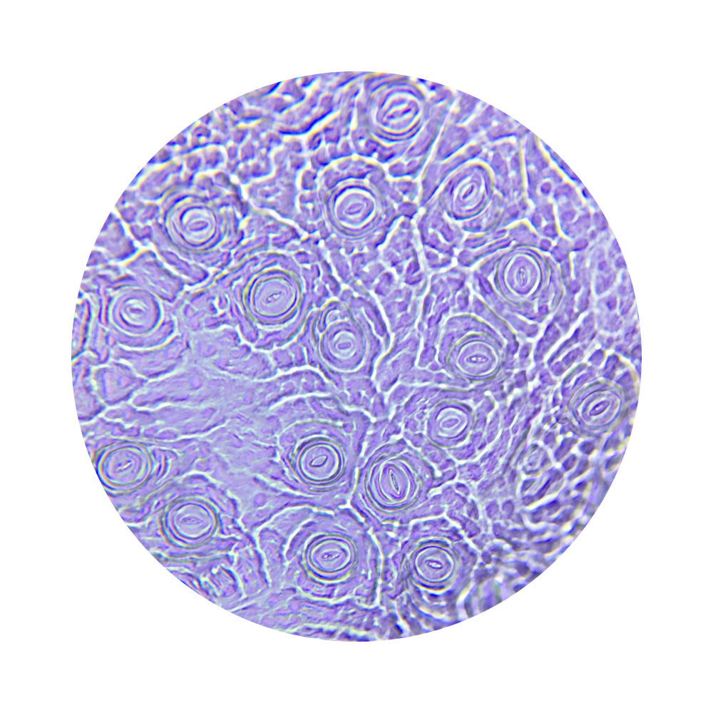

# Microscopy

Nobody has seen stomata with the naked eye. You can admire stomata with a **microscope**. That is a cool experience, because you can also **photograph** the stomata through the microscope with a smartphone. You can, for example, use a monocular microscope that magnifies 400 times.  
When you look at **living** material through the microscope, you can see beautiful images (See Figure 1). However, you need to manage to remove a piece of the extremely thin cuticle of the leaf. With some plants, this isn’t so easy, for example, because of the toughness of the leaf.

<figure>
    <figcaption align = "center">Figure 1: Microphoto of living material.</figcaption>
</figure>

You can compensate for this by using the same method as the researchers from the Plantentuin Meise, namely taking an **imprint** of the leaf with transparent nail polish (Figure 2).

<figure>
    <figcaption align = "center">Figure 2: Taking a leaf imprint with nail polish and tape.</figcaption>
</figure>

The photos are no longer so beautiful in color, but grayish (see Figure 3). But all in all, it still produces beautiful pictures; nature at its best.

<figure>
    <figcaption align = "center">Figure 3: Microphoto of a leaf imprint.</figcaption>
</figure>

By choosing a variety of plants, you also get a **variation** in the images: monocots and dicots, large and small stomata, stomata of different shapes...