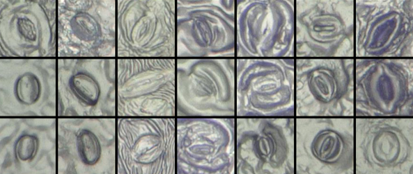

# Bias in KIKS

The KIKS model also contains a bias. The photos of the training set are taken in such a way that the stomata approximately fit in a box of **120 X 120 pixels**.
These examples are prints of leaves taken with transparent nail polish. This means that the model will perform best on images
of stomata of similar size in a similar, **greenish-gray color**.

 
<figure>
    <figcaption align = "center">Examples of stomata from the training set.</figcaption>
</figure> 

This also means that if you submit a microphoto to the network with stomata that are too small or with many different colors, the network might not properly detect the stomata in that photo.
