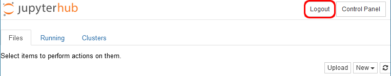

# Working with notebooks

**Note: logging out**  

*When you have completed a series of notebooks, do not forget to log out via the button at the top right in the tab with the notebook group.*  

  

If you do not do this, then the new link will still display the previous series of notebooks, instead of the new series.

There is no need to log out of the notebook itself.

**Saving the notebook**

You can download the notebook as an *ipynb* to work on it at a later time.

You can save the (executed) notebook as a *pdf* via the browser. For example, in Chrome: Print > Save as pdf. It is best to set 'Scale' to 85 percent.