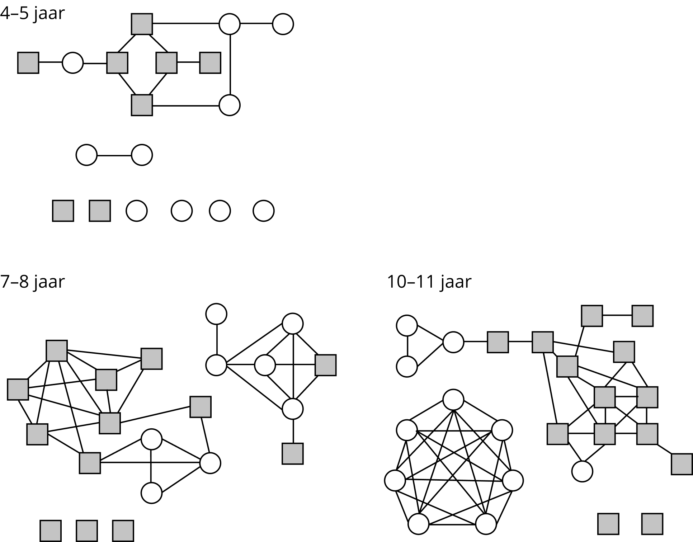

# Social Networks

The standard SIR model makes the unrealistic assumption that any two random individuals always have the same chance of coming into contact with each other and possibly transmitting a disease. In reality, of course, not everyone interacts with the same people. We all have people we interact with (come into contact with) more than others. The totality of who is in contact with whom is called a *social network* (think of Facebook). It seems evident that the structure of such a network will have a strong influence on the dynamics of disease spreading.

Social networks are also modeled mathematically, based on the so-called 'graphs'. A graph consists of a collection of nodes some of which are connected by arcs. In the example below, the nodes represent students. Contacts between students are represented by line segments between nodes and are called *arcs*.

Source: https://royalsocietypublishing.org/doi/pdf/10.1098/rspb.2010.1807

A figure is useful to see what the network looks like. However, other representations are needed to perform calculations. A graph can be mathematically represented in a matrix called an *adjacency matrix*.

## Disease Spread Models in Practice

Epidemics occur continuously, and therefore public health organizations around the world use models to develop and evaluate intervention strategies. Using simulations, they can quickly assess the situation and make important decisions.

To recognize and respond to an epidemic, health workers need information that is inherently unpredictable (what, where, how many cases, how many will die, where will it spread). The interactions that lead to an outbreak of a disease are very complex, so that the results can sometimes be unexpected or counterintuitive. Models are needed to understand these interactions and to make the quantitative predictions that public health workers need to decide on intervention strategies.

Human behavior during disease outbreaks often changes drastically. People avoid busy places or rush to busy places like airports or train stations, trying to escape the epidemic. Modeling can help health workers anticipate and understand these kinds of effects.

Models can also be used to determine how resources should be allocated to have the best chance of stopping the spread of the disease - for example, if vaccines are limited, which group of people should be vaccinated as a priority? Scientists can use models to compare the outcomes of different control strategies. Models can also be linked to long-term climate data and climate predictions, to make outbreak predictions many months into the future. This approach is used to determine vaccination campaigns, for example against influenza or measles.

Scientists develop their understanding of disease spread using data such as behavioral, demographic, and epidemic trends, but it is often difficult to collect reliable data, and for many diseases, we still lack important information about how they spread. Modeling can also help in these cases, as scientists can test different hypotheses to try to fill the gaps in their knowledge.

***

In these notebooks, the SIR model will be applied to a network, and you will simulate certain situations in the model yourself.

