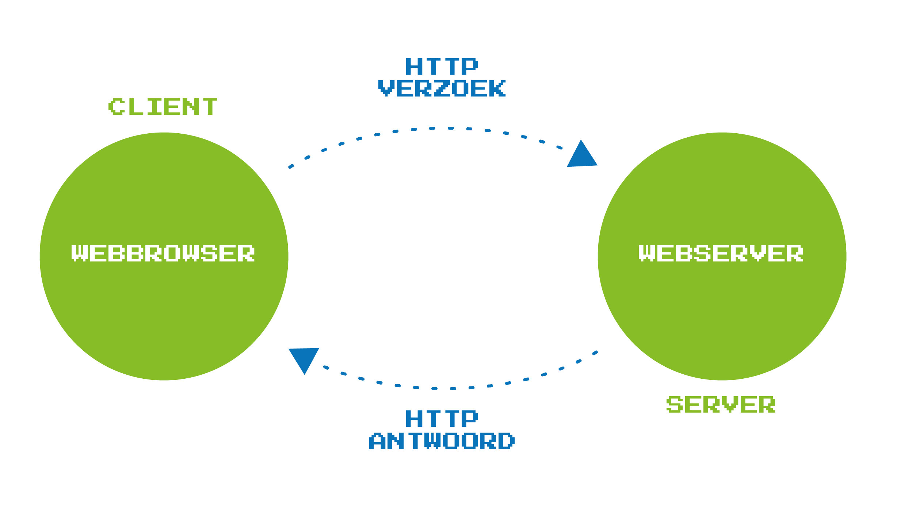

# IP Address
The internet provides access to the world wide web, where one can find all sorts of information via websites. 
Every website has a unique location on the internet, represented by its **Internet Protocol address**, or IP address. 
> A protocol is a set of rules that defines how two digital devices can communicate with each other.

IP addresses consist of a series of numbers (usually four numbers). For example, the website of AI Op School bv. has 157.193.244.98 as its IP address. 
Such an IP address is not easy to remember, which is why we use domain names like [www.aiopschool.be](http://www.aiopschool.be).

The conversion from the domain name to the IP address is done through the **Internet Domain Name System (DNS)**. 
When a domain name is entered into a web browser, the browser will contact the DNS server. This server has a database of the domain names with their corresponding IP addresses. The browser will ask the DNS server for the IP address
of the desired website, after which it will display the requested website.

Some IP addresses are constructed with decimal numbers, others with hexadecimal numbers. 
This notebook, therefore, pays ample attention to binary, decimal, and hexadecimal numbers. You will also learn how to fluently convert from one numerical system to another using Python. 
With this notebook, you can illustrate why binary and hexadecimal numerical systems are important in computer science.

----
#### Link with the minimum objectives

This theme focuses on computational thinking. An IP address, after all, provides an answer to the question of how your computer can find a desired website. Through this internet protocol, the browser on your computer succeeds in displaying the website with that specific domain name on your computer screen.

You can use this as a theme to work in the classroom on the minimum objective concerning the impact of digital systems. Because digital systems can communicate with each other, we can, for example, make use of the Internet of Things (IoT).