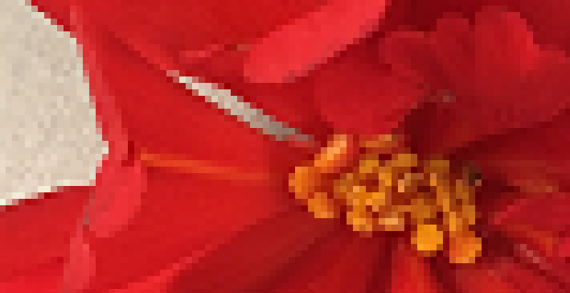

# Introduction
A digital image consists of a finite number of pixels. If you place enough squares in a grid, you can represent a large figure. 
The word 'pixel' is derived from the English words *picture* and *element*. 
The word digital comes from the Latin *digitus* (finger) and refers to counting on the fingers.

On a good photo, you cannot distinguish pixels, unless you zoom in strongly on the image.

In this learning path, you will learn how to adjust and manipulate the colors of an image.