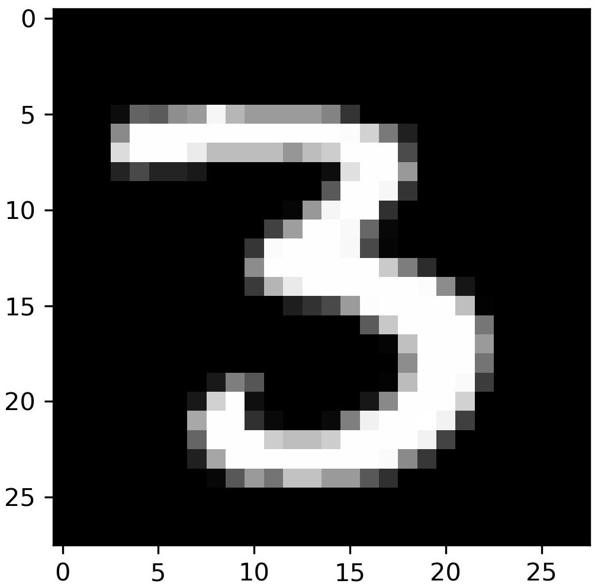
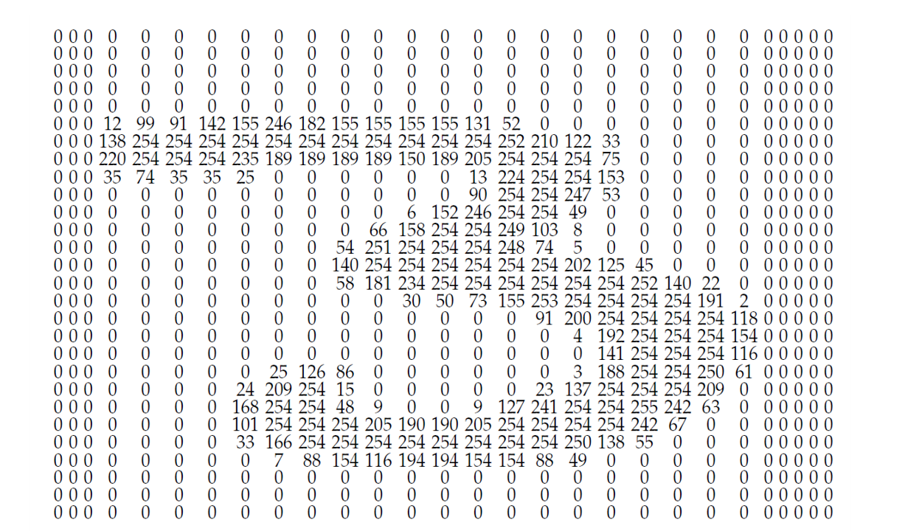

# Grayscale Images

A grayscale image for a computer is nothing but a grid of numbers.

<figure>
    <figcaption align = "center">A three from the MNIST dataset. The MNIST dataset comprises 70,000 images of handwritten digits, each 28 x 28 pixels in grayscale.</figcaption>
</figure>

<figure>
    <figcaption align = "center">The pixel values of this three.</figcaption>
</figure>

---

To become familiar with this, you can work through two notebooks.

The first notebook reveals how digital images in grayscale are constructed and how the computer interprets them. 
The second notebook shows how you can manipulate an image by performing operations on the grid.

---

#### Assignment

Within the context of the media literacy minimum objective from the second grade, **“The impact of digital systems”**

Some possible lines of thought: 

* Do you understand how photos can be manipulated?
* Can you make the link to fake news?
* How can you improve photos? For example, how can you make them darker or lighter?
* What could this mean for the job of a photographer or designer?
* What you learned in the notebook fits within the digital representation of information. Explain this.

---

#### Link with mathematics minimum objectives

In mathematics, such a grid is called a **matrix**.
