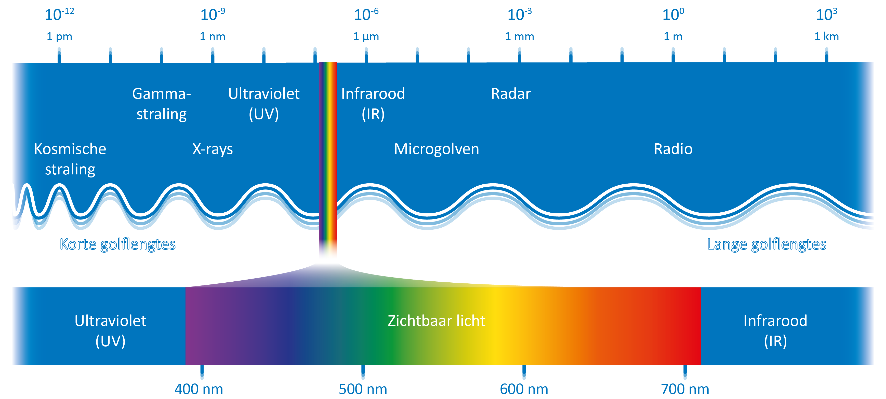
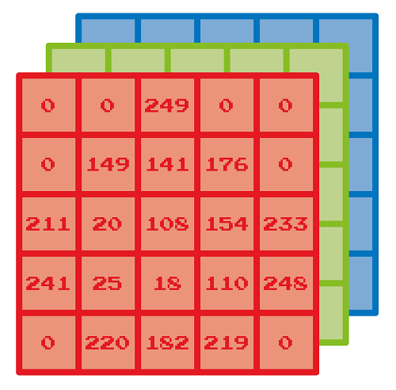
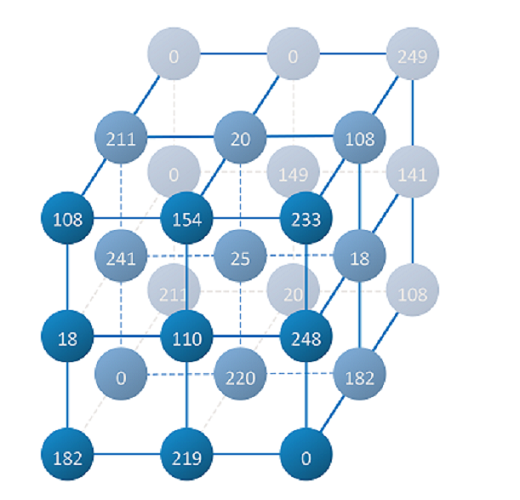
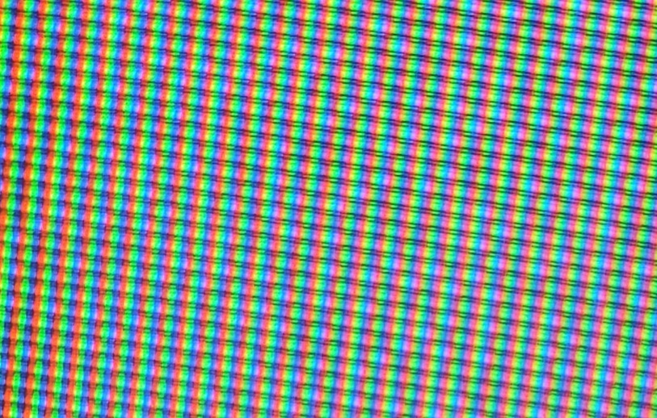

# Images in Color

In this notebook, you will become familiar with the mathematics behind digital images in color. Instead of matrices, tensors are now used.

----
Colors occur in a spectrum.

The colors that humans see can be approximated by a combination of red (R), green (G), and blue (B) shades. 
Colors can be digitally represented using RGB. In that case, a separate table is needed for the red, green, and blue components; together these form a 3D grid.

The colors on a television set, for example, are also constructed using RGB, as you can see in the following zoomed-in photo of a part of a television image.

