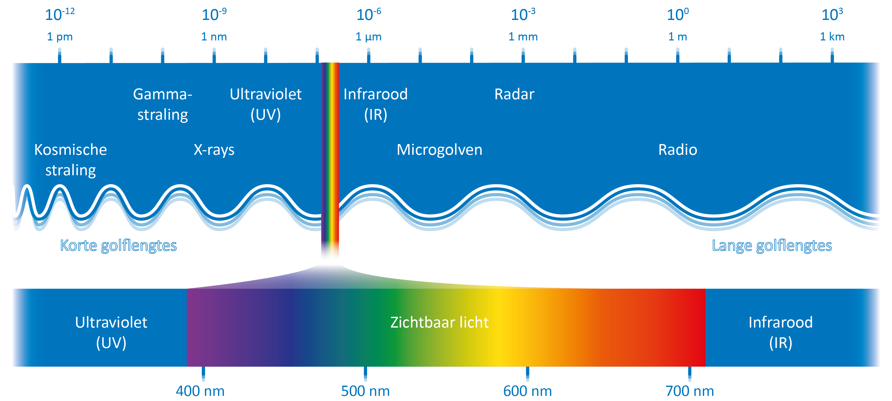
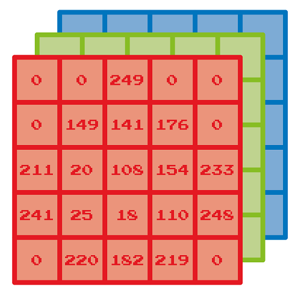
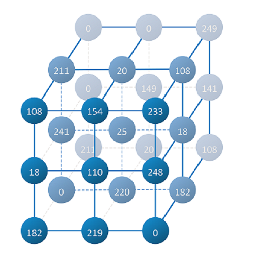
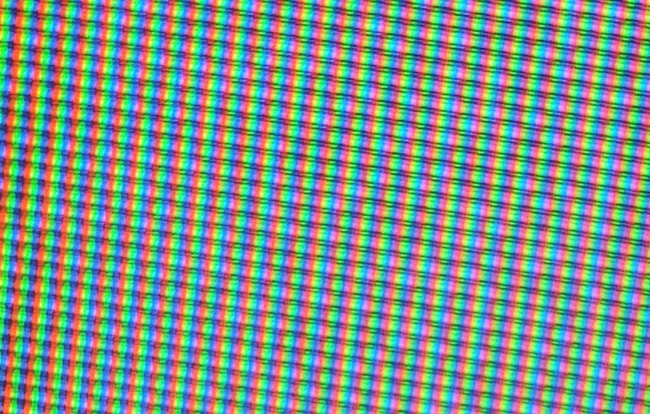

# Images in Colour

In this notebook, you will become familiar with the mathematics underlying colour digital images. Instead of matrices, tensors are used.

----
Colours occur in a spectrum.

The colours that humans see can be approximated by a combination of red (R), green (G), and blue (B) shades. 
Colours can be digitally represented using RGB. In that case, a separate table is needed for the red, green, and blue components; together, these form a 3D grid.

The colours on a television set, for example, are also constructed using RGB, as you can see in the following zoomed-in photo of a part of a television image.

