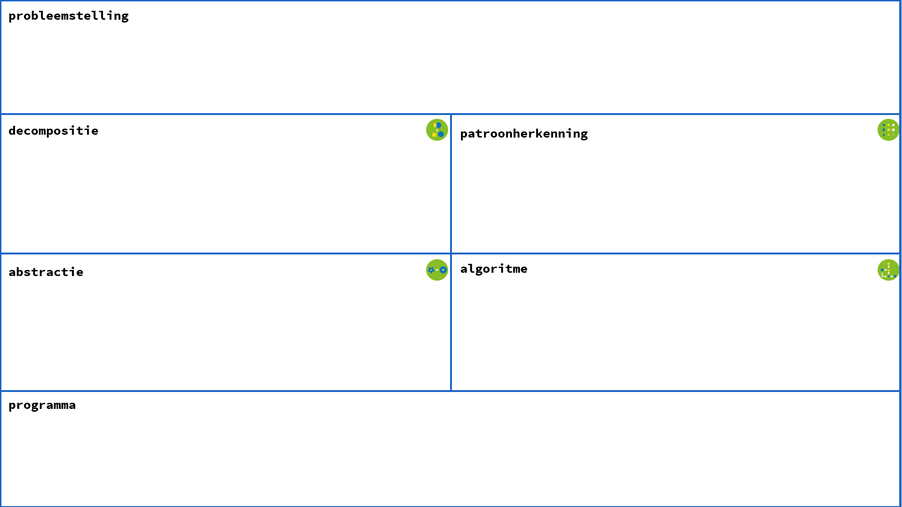

# Secret Message

 This notebook shows how a message can be hidden within an image. You can see the message by detecting a deviating pattern in the pixel values of the image.

---
#### Link with the Minimum Learning Objectives on Computational Thinking and STEM

In this assignment, you practice computational thinking. 
You have to think about the digital representation of information, in this case an image. 
Problem statement: Reveal the secret message hidden in the image in the notebook. 
Complete the diagram.

