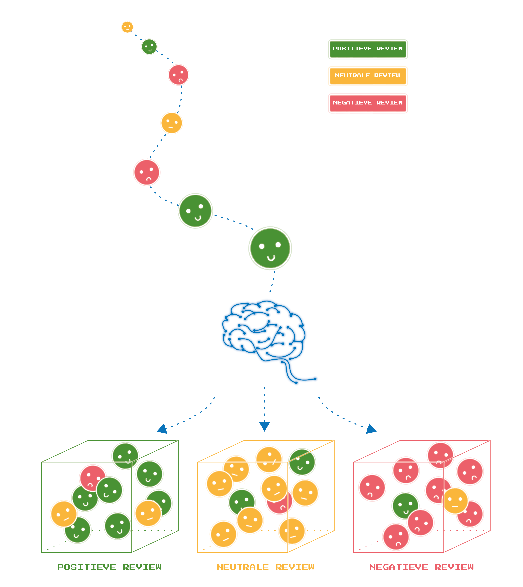

# Language Technology: Sentiment Analysis
In these two interactive notebooks, it becomes clear how sentiment analysis with rule-based or data-based systems is done.

In automatic sentiment analysis, an AI system decides whether a review is positive, negative, or neutral. Such a system is never 100% accurate.

