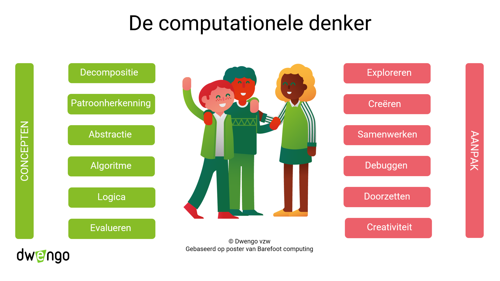

# Eindtermen

We gaan ervan uit dat dit project vooral in de lessen Techniek of lessen STEM gegeven wordt.
We geven daartoe mee aan welke eindtermen er gewerkt kan worden. We geven ook aan op welke manier dit kan gebeuren. [**Dit overzicht**](embed/eindtermen_socialerobot.pdf "Eindtermen") beschrijft dit alles uitvoerig.

Je beslist zelf aan welke eindtermen en leerdoelen er wordt gewerkt. Als de aanpak gevolgd wordt die Dwengo voor het project voorstelt in het kader van AI Op School, zouden bepaalde eindtermen zeker aan bod moeten komen.
**Hoe jij als leerkracht dit project invult, bepaalt welke eindtermen effectief aan bod komen en in welke mate.**

## Computationeel denken

Bij het ontwerpen van de robot komt computationeel denken ruim aan bod. Zo moeten de leerlingen o.a. uitvissen welke elektronische onderdelen ze nodig hebben om de robot te laten doen wat ze willen en zullen ze in hun eigen woorden instructies noteren over hoe de interactie met de mens zal gebeuren.

Bij het werken aan dit project is het dus essentieel om de computationele vaardigheden van de leerlingen te begrijpen en te evalueren. Zo kan men vaststellen welke vaardigheden de leerlingen inzetten en welke ze nog moeten ontwikkelen. Het is belangrijk om de leerlingen te begeleiden en hen te helpen bij het versterken van deze vaardigheden.

