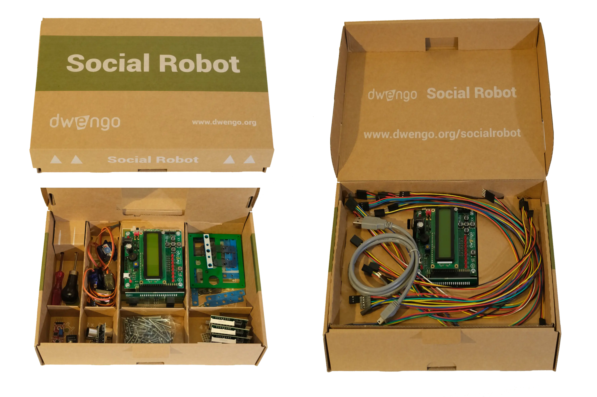

# Material

Dwengo has developed a kit with electronics and tools for building your own social robot for the 'Social Robot' project. 

One such kit contains the following materials: 

Each set also comes with a [**notebook**](embed/ficheboekje_leerkracht.pdf "Notebook") containing notes with additional explanations that have been made for the students so that you are optimally prepared.

## Buying material
Dwengo sells these kits in sets of 5. For more information, please visit [**our webshop**](https://www.dwengo.org/shop/).
