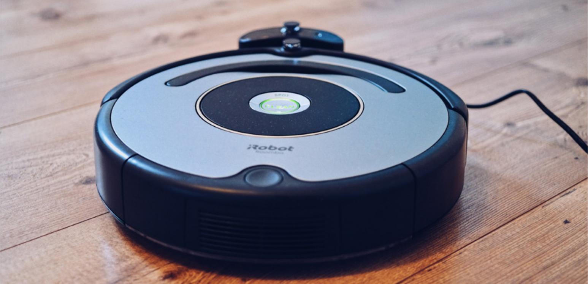

# What are social robots?
## Digital systems

*Today, digital devices are indispensable in our society. Think of a robot vacuum cleaner, a washing machine, an electric toothbrush, or a clock radio.*

These are also referred to as **digital systems**. Many of these devices are controlled by a **microcontroller**. Digital systems have inputs and outputs. The microcontroller receives data from the inputs (**input**), processes the data, performs calculations, and then controls the digital devices (**output**).  
In this project, you will use the **Dwenguino**, which is a microcontroller platform that allows you to quickly and easily build your own device.

> Discussion Is a robot vacuum cleaner a social robot?

© Jens Mahnke via Pexels