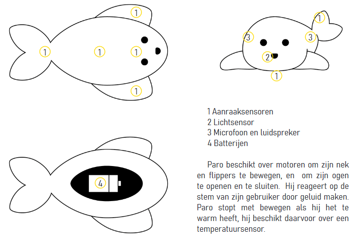

# What are social robots?
## Social robots

Social robots are robots that can communicate with humans. They are used in various sectors of our society, such as the healthcare sector and the hospitality industry. 

In nursing homes, social robots are used to keep elderly people company and stimulate social interaction. In hospitals, they are used for rehabilitation exercises. Social robots can also be used at home, for example to remind people to take their medication so that they can stay at home longer, or to teach children how to manage their diabetes.

> Discussion Is a social robot good company for a lonely elderly person?

In education, social robots can be used to guide students individually, or a student can explain the subject matter to a peer robot.

At the airport, a robot directs travelers to the correct gate. In the museum, a robot gives a guided tour. In some hotels, a robot is stationed at the reception desk. In the store, a robot can inform customers about current promotions.

> Discussion Look at the image below. What animal does Paro represent? What would Paro use all this equipment for?

Paro keeps elderly people company - © Peter Häll

