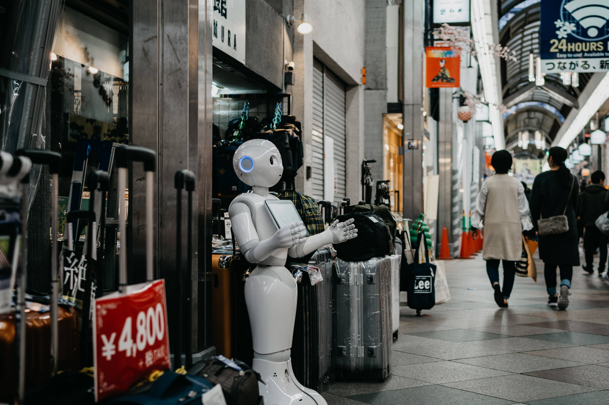

translate
# What are social robots?
## Social robots in the future

*Robots are popping up everywhere, like a robot vacuum cleaner in your home, a robot in the hotel that welcomes customers, a robot for the demining service, a robot in the car factory, and a surgical robot.*

*Thanks to developments in robotics and research into the interaction between humans and robots, more will be possible in the future in the field of social robots.*

*What will the future look like? Will robots become as indispensable in our daily lives as our smartphones?*

There are still many question marks about this! Dreaming about a future with robots is certainly exciting: robots to transport us and entertain us, robots for the classroom, robots for better healthcare, and maybe even a robot as a colleague.

In the healthcare sector, there is a shift towards robots that not only provide companionship but also monitor people's health.

> Discussion Would you rather receive an injection from a robot or a nurse?

For education, there is a focus on robots that can take on more active tasks, such as teaching a foreign language.

It is predicted that our homes will increasingly evolve into smart homes, where daily tasks are automated and even furniture is smart.

There is also experimentation with social garbage bin robots, such as the Sociable Trash Box, which approaches people and motivates them to throw their trash in the bin.

> Discussion What applications can you think of for social robots in the future?

Reception robot Pepper - © Lukas via Unsplash