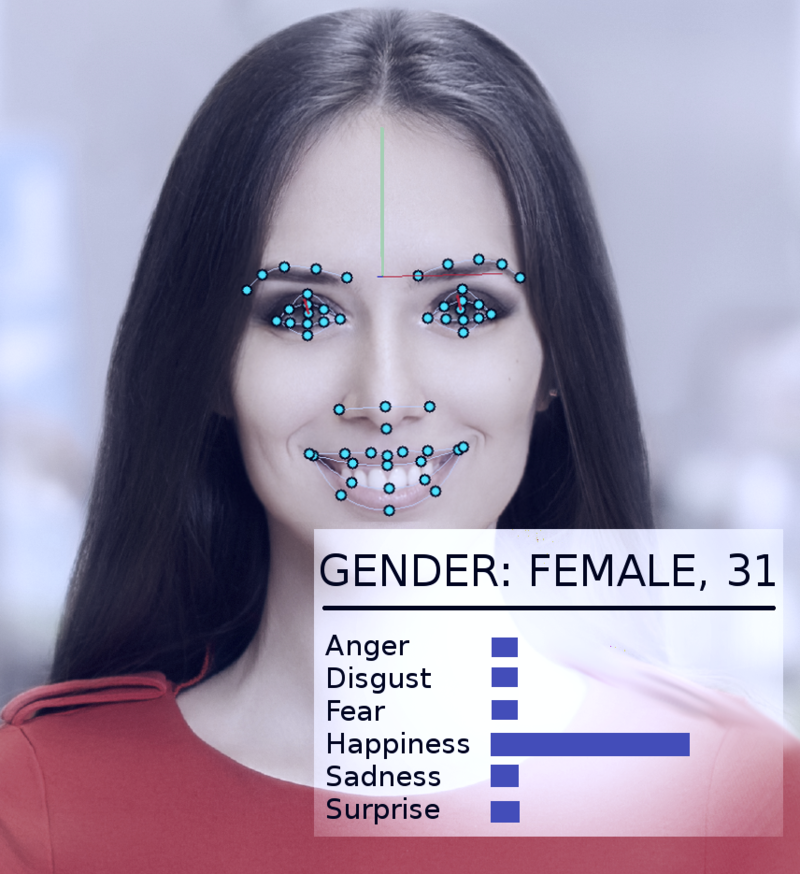

# Unplugged Computational Thinking
## Emotion Machine
### 20 minutes in the classroom

The students design a face and program a 2D cardboard robot to express different emotions. They create a table in which they translate emotions (high-level) into instructions (code) that can be understood by a machine (low-level). They then draw the emotions on strips of cardboard that represent a certain position of the eyebrows, eyes, and mouth.

Later (during the building sessions), they can also program the emotions with the LED matrix of their social robot. For this, the students think about how they can represent the eyebrows, eyes, and mouth on the LED matrix.

Optionally, you can also briefly mention that nowadays facial recognition is being extended to recognize emotions using AI techniques. This allows computers to better recognize emotions in facial expressions, which can lead to new applications in, among other things, healthcare and security.

By Abyssus - Own work, CC BY-SA 4.0

### Material
* [Table of emotions](embed/emotiemachine_gids.pdf "table")
* [Face 1](embed/emotiemachine_gewoon_nl.pdf "regular face")
* [Face 2](embed/emotiemachine_matrices_nl.pdf "face 2")