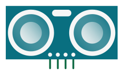
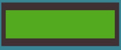
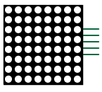
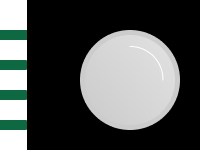

# Robot components
## Overview

Below are the different robot components provided in the "Social Robot" package by Dwengo.

## Sensors (input)

| **Name**       | **Image**                                    | **Description**                                                                                                                                                                                                                                           |
|----------------|----------------------------------------------|------------------------------------------------------------------------------------------------------------------------------------------------------------------------------------------------------------------------------------------------------------|
| Button         |              | There are 5 built-in push buttons provided on the Dwenguino: NORTH, EAST, SOUTH, WEST, and MIDDLE.                                                                                                                                                        |
| Sonar sensor   |     | Use this sensor to detect a person or object and determine how far away the person or object is from the sensor. In the simulator, a slider is provided to simulate this. The sensor returns the distance in centimeters.                                    |
| Sound sensor   |   | Use this sensor to detect sound. In the simulator, a button is provided to simulate sound by pressing the button. The sensor returns 1 for sound and 0 for silence.                                                                                         |

## Actuators (output)

| **Name**              | **Image**                                        | **Description**                                                                                                                                                                                                                                                                                                                                                                       |
|-----------------------|--------------------------------------------------|----------------------------------------------------------------------------------------------------------------------------------------------------------------------------------------------------------------------------------------------------------------------------------------------------------------------------------------------------------------------------------------|
| LCD screen            |            | The LCD screen has two lines, each with 16 characters. You provide the desired text in your program.                                                                                                                                                                                                                                                                                 |
| Servo motor (blue)    |     | A blue servo motor can rotate to a certain angle between 0 and 180 degrees. When used in the simulator, you provide the desired angle in your program.                                                                                                                                                                                                                                |
| Servo motor (black)   |    | This motor can rotate fully. When using the black servo motor, you provide the desired speed from -255 to 255.                                                                                                                                                                                                                                                                      |
| LED matrix            |           | The LED matrix is a square with 64 LEDs in a fixed color. The matrix is ideal for illuminating certain patterns, such as an eye, a mouth, or another symbol. Blocks are provided to create the patterns. You can also connect the matrices together (maximum 4) if you want to attach multiple matrices to your robot. |
| RGB LED               |                 | The RGB LED is a LED that does not have a preset color. You can make the LED light up in a certain color by setting a value between 0 and 255 for red, green, and blue.                                                                                                                                                                                                                    |