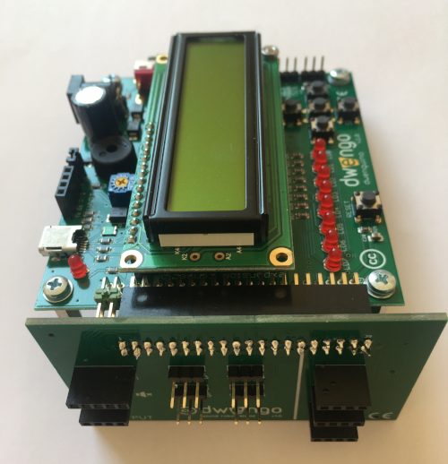

# Building the physical robot
## The motherboard
You will be using the Dwenguino and its accompanying expansion board. When cutting out the recesses, you will need to provide space for this!

Note that the USB port of the Dwenguino must be accessible for comfortable connection of the USB cable.

### Wiring and assembly

Before attaching the components to the body of the robot, it is wise to first connect the wiring between the Dwenguino and the other components. This prevents there from being too little space left to connect the wires after the components have been attached.

The image below shows which components are present on the Dwenguino and which actuators can be connected directly to it.

*The contrast of the LCD screen can be adjusted. You can power the Dwenguino via the USB cable or an adapter.*

On the *extension connector*, you can connect the expansion board (see image). This is specifically tailored for the social robot. With this, you can connect all other sensors and actuators.

