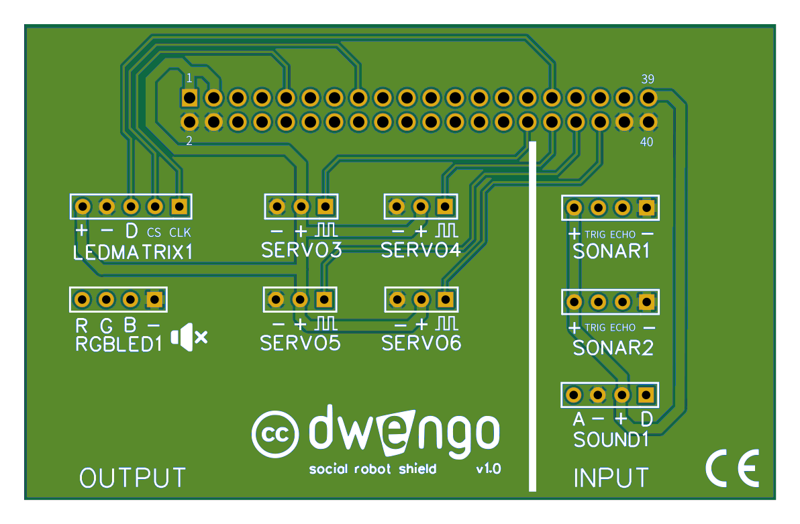

# Building the physical robot
## The expansion board

An additional advantage of using an expansion board is that the connectors are labeled with the specific sensors or actuators they are intended for.

Be careful when connecting or disconnecting the expansion board and the Dwenguino. The pins bend very easily, which can result in a poor connection between the expansion board and the Dwenguino.

### Wiring and assembly
When plugging in your pins, it is important to connect the correct components to each other. The sensors and actuators have symbols such as '+', '-', and 'GND' at their connectors, and it is important to connect these to the corresponding pin on the expansion board.

You can easily do this with [these cards](embed/leerlingenfiches.pdf "cards").

Once the wiring is in order, you can mount the electronics on the body of the robot.

If you have difficulty attaching certain items to the body, you can also consult the cards for help with the attachments. There we show you how to quickly attach something with the help of accessories.