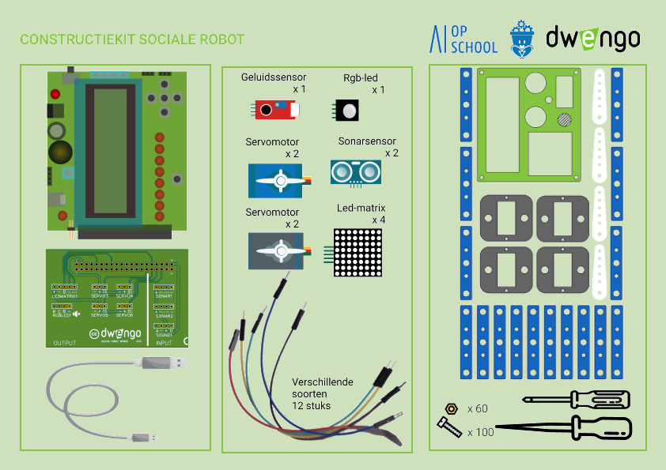

# Opruimen

Jammer genoeg moet je op het einde van de rit je robot afbreken ... Wees gerust, je kan de meeste onderdelen houden! Enkel de elektronica zal je eruit moeten halen en opbergen in de doos. In de doos vind je terug welk onderdeel waar hoort. Hieronder geven we je alvast ook nog eens een overzicht van de inhoud:

Je kan eventueel de sensoren namaken in papier of karton om de looks na te bootsen.

