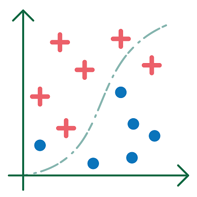

# Machine learning

Machine learning (ML) is a popular and successful part of artificial intelligence (AI). In *machine learning*, the approach is mainly empirical but based on solid mathematics, using principles from mathematical statistics (Chollet, 2018).

AI systems are developed by humans. They incorporate parameters whose values are not yet fixed. 
During training, the system learns. This means that it searches for the optimal values for the unfixed parameters using a learning algorithm. 
After training, these values are determined, giving an ML model, or an ML system that is ready for use.

**A machine learning system acquires knowledge from data using learning algorithms with the intention of predicting outcomes related to new data.**

- The new data must be similar to the data provided.
- These predictions are made with a particular level of certainty. ML models will therefore never be one hundred percent accurate.

    Learning algorithms are algorithms in which the ML system itself gradually makes adjustments to the parameters during the learning process, to achieve better performance over time.

> An ML system therefore does not make its decisions based on pre-programmed and detailed instructions.

The decisions of an ML model are called *predictions*.

### Regression and classification

    Predicting based on tendencies is a <b>regression problem</b>.  
    Predicting a class is a <b>classification problem</b>.  
    <b>Predicting</b> means, for example, that future figures are generated from past tendencies (regression) or that an object is classified into a certain category (called a class) (classification).

> Instead of categories, in this context, we often speak of classes.
 
> **Concrete examples of regression:**  
> - predicting the price of an apartment using the prices of apartments that have already been sold; 
> - deducing the future sea levels in Ostend using sea levels from the past few decades.  

> **Concrete examples of classification:**  
> - determining whether an email is spam;  
> - being able to say whether a photo includes stomata.

 
<figure>
    <figcaption align = "center">Regression.</figcaption>
</figure> 

 
<figure>
    <figcaption align = "center">Classification.</figcaption>
</figure>
