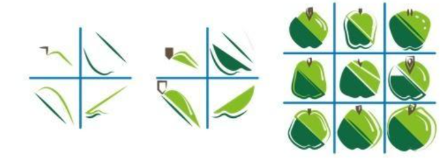

# Deep learning

One element of machine learning (ML) is ***deep learning (DL)***. This has revolutionized the field of ML by achieving remarkable results in speech and image recognition, areas where computers have previouslyfound it challenging to match human performance. Beyond speech recognition, DL also plays a significant role in other domains of language technology.

> **Example:** 
> Suppose you wanted to train a spam filter. This must learn to distinguish emails that are spam from those that are not.
> An ML system like this is trained using a so-called labeled training set: a large number of emails labeled as either spam or not. 
> After the training, you will have a model that you can use to assess new emails as spam or not spam (see Figure). This model will not be perfect. There will still be spam emails that slip through the cracks, and some emails will incorrectly end up in the spam inbox.

    How does <b>training</b> work?  
    At the beginning of the training process, the algorithm chooses <em>random values for the parameters</em> of the system. It is therefore no surprise that the network initially does not perform well. During the training, the algorithm <em>adjusts the values of the parameters</em>, based on the labeled examples, and the results improve. 

    
Spam filter

    
There are therefore deep learning models for tasks such as regression and classification. 
**Convolutional deep neural networks** are particularly well-suited for recognizing objects.

### Convolutional Neural Networks

> Convolution is a mathematical operation that uses only addition and multiplication. It involves assigning a certain weight to a pixel and adding weighted values of the surrounding pixels.

Convolutions can be used to look for various features in an image. For example, to detect vertical and horizontal lines, reduce noise in an image, or soften the contrast in an image. In each layer of the convolutional neural network, the data representation is transformed into a new data representation through convolutions.

In the learning path [Deep learning - basic](https://dwengo.org/learning-path.html?hruid=kiks3_dl_basis&language=nl&te=true&source_page=%2Fkiks%2F&source_title=%20KIKS#kiks_inleiding;nl;3) of the KIKS project, you can experiment with convolutions. In the learning path [Deep learning - advanced](https://dwengo.org/learning-path.html?hruid=kiks4_dl_gevorderd&language=nl&te=true&source_page=%2Fkiks%2F&source_title=%20KIKS#kiks_convolutie_bewerking;nl;3), you can delve into the underlying computations.

### Model for object recognition vs. generative model

- An **object recognition model** is a classification model. It will assign a label to a particular image, e.g., dog. A classification model that predicts a label will consider which label it is most certain of for a given image.  
- A model that generates images is a **generative model**. It will generate an image that corresponds to a given label. If a model like this has learned the features of a dog, it can generate an image of a dog that wasn't in the training set. A generative model will consider which image it is most certain of for the given label.

> Underlying mathematics: to predict a class, P(Y|X=x) is calculated, and to generate something, P(X|Y=y).
(https://en.wikipedia.org/wiki/Generative_model)

> **Examples** of generative models include DALL·E 2, which generates images, and ChatGPT, a large language model (LLM).

    Murray Shanahan says that we must be aware of what a large language model does.  
    "Suppose we give the following prompt to an LLM: “The first person to walk on the moon was ”, and let's say it responds with “Neil Armstrong”. 
    What are we actually asking here? It's important to realize that we're not really asking who the first person was to walk on the moon. The actual question we're asking of the model is this: Given the statistical distribution of words in the very extensive public corpus of (English) text, which words are the most likely to follow the sequence “The first person to walk on the moon was ”? A good answer to this question is “Neil Armstrong”.  (Source: Talking About Large Language Models, Murray Shanahan, 2022)
    

