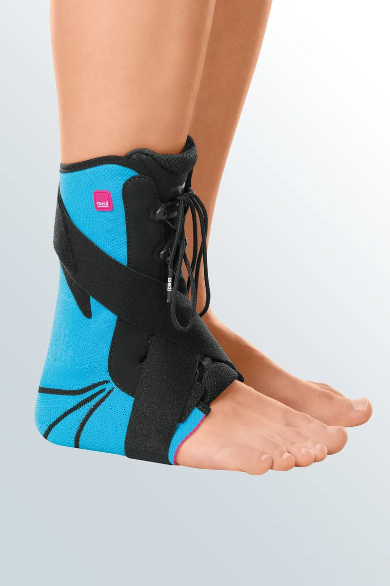

# Ankle-Foot Orthoses
Today, there is already a significant number of orthoses on the market, which try to meet as many criteria as possible. Some orthoses take more account of the aforementioned criteria than others.

We will look at several orthoses that are currently available on the market. Below you will find a summary of the different properties per criterion of the orthoses.

**Malleoloc-L (by Bauerfeind)**

[www.bauerfeind.nl](https://www.bauerfeind.nl/nl_nl/producten/braces/enkelbrace/details/product/malleoloc-l)

**ROM Walker (by Medi)**

[www.medibelgium.be](https://www.medibelgium.be/producten/medi-rom-walker/)

**M.Step (by Medi)**

[www.medibelgium.be](https://www.medibelgium.be/producten/m-step/)

**Stabili-tri (by Levamed)**

[www.medibelgium.be](https://www.medibelgium.be/producten/levamed-stabili-tri/)

**EXO-L:**
[www.exo-l.com](https://www.exo-l.com/nld/)

**B2-Foot AFO (by Spentys):**
[www.spentys.com](https://www.spentys.com/social-sharing/b2)

# Properties of Current Orthoses
The orthoses on the market today all have different properties. In the table below, you can find the properties of each orthosis. We will first briefly explain what these properties entail:

* **Stabilization of injury**: patients use the orthosis for rehabilitation. Depending on the 'degree' of the injury, the rehabilitation can be shorter or longer. A first-degree injury requires 2-10 days of rehabilitation, a second-degree injury 4-6 weeks, and a third-degree injury 6-8 weeks. A first-degree injury is usually a sprain, while the second and third-degree injuries involve one or more torn ligaments.

* **Price**: this is how much the orthosis costs

* **Material**: an orthosis must be made of the right material. A completely metal orthosis is too heavy to walk around with, while a woolen orthosis offers no stability. Current orthoses are mainly made of plastics.

* **Adjustability**: an orthosis that is more adjustable is multifunctional. It can be adjusted depending on the type of injury and/or shoe.

* **Custom fit for the patient**: just like a shoe, a t-shirt, or a sweater, an orthosis comes in a certain size. Some orthoses only come in one size, while others are completely custom-made for the patient.

The properties of these ankle-foot orthoses can be found in the table below:
|                                      | **Malleoloc-L**                        | **ROM Walker**                                                  | **M.Step**                                                                  | **Stabili-tri**                                                             | **EXO-L**                                 | **B2-Foot**                                           |