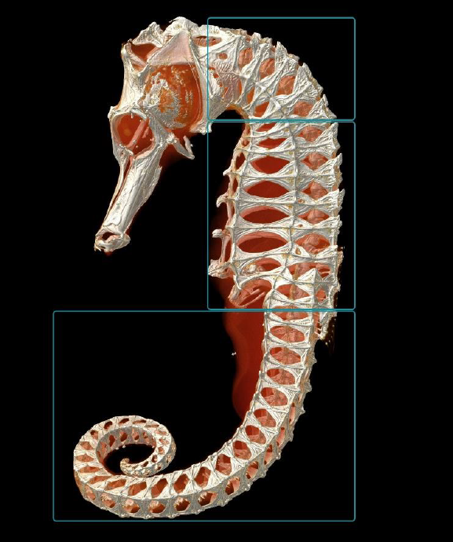
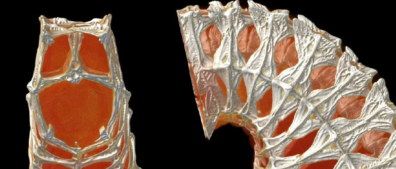
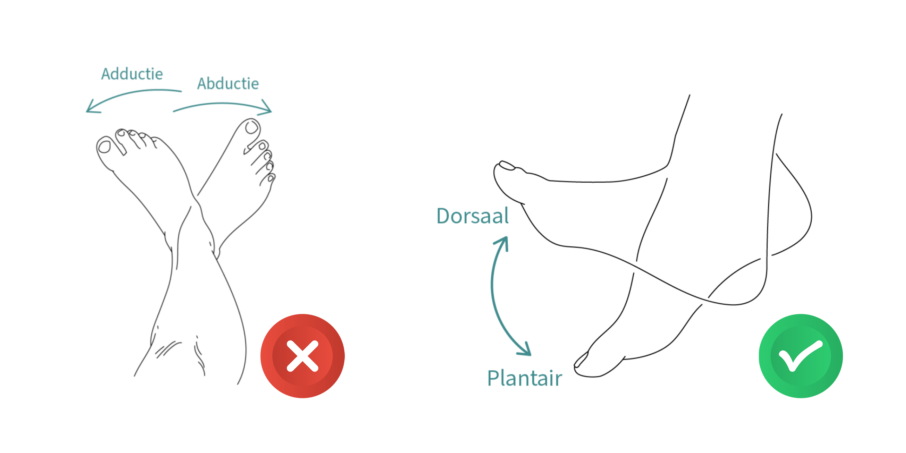
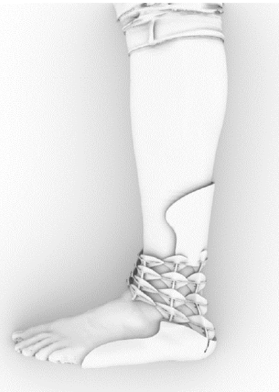
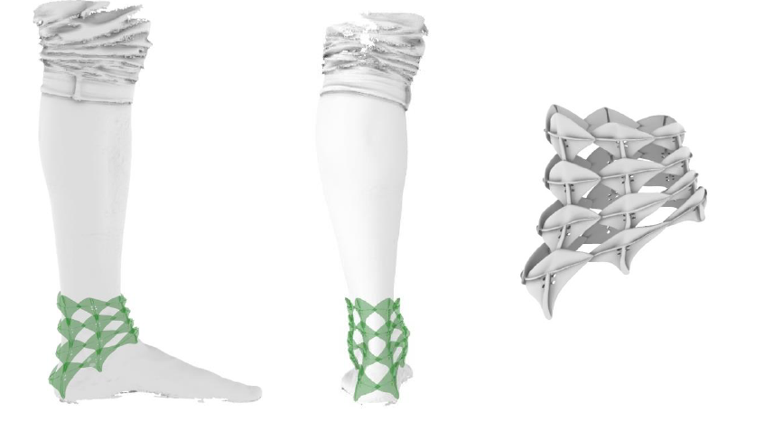
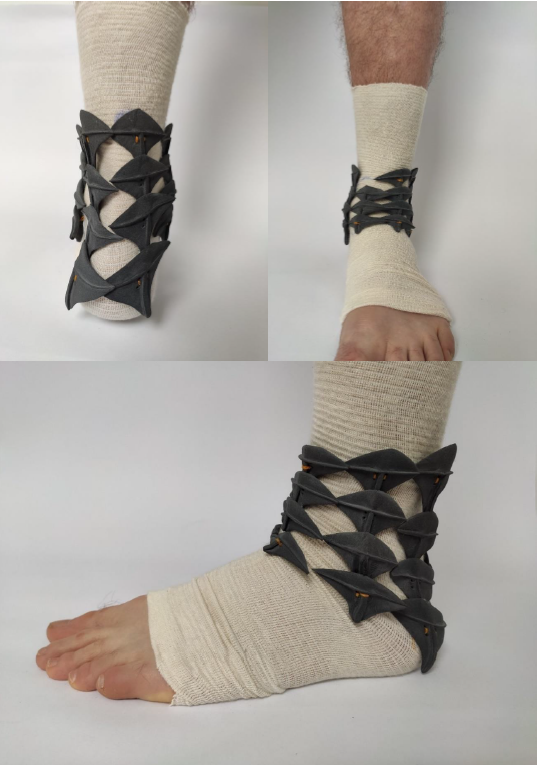

# Seahorse-based Ankle-Foot Orthoses

We look at the neck region of a seahorse to create an ankle-foot orthosis. A seahorse's bony armor consists of bony plates that can slide into one another. The bony plates have a prominent spine, and the next plate has a groove in which that spine can easily slide in and out. Thus, a seahorse can smoothly move its tail in different directions. But the same system can be found at the level of the neck and belly as well.

Below you see the structure of the bone plates in a seahorse:

 

 

As previously indicated, the seahorse's neck can stretch and retract, but it can move much less in the lateral directions. This is what we need for the ankle-foot orthosis. Here, the foot must be laterally fixed but may still move in the so-called dorsal and plantar directions (see figure).

The ankle-foot orthosis consists of 3D-printed plates based on the construction of the neck region of a seahorse. The final result is supplemented with two shells, at the top and bottom, to come to a workable ankle-foot orthosis.

A first prototype of an orthosis based on the seahorse has already been made. This was the result:

