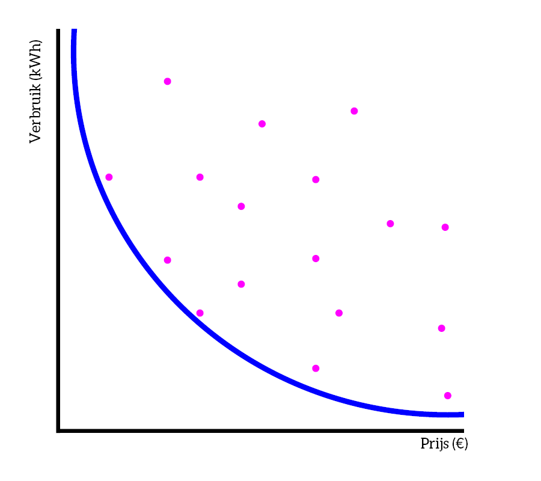
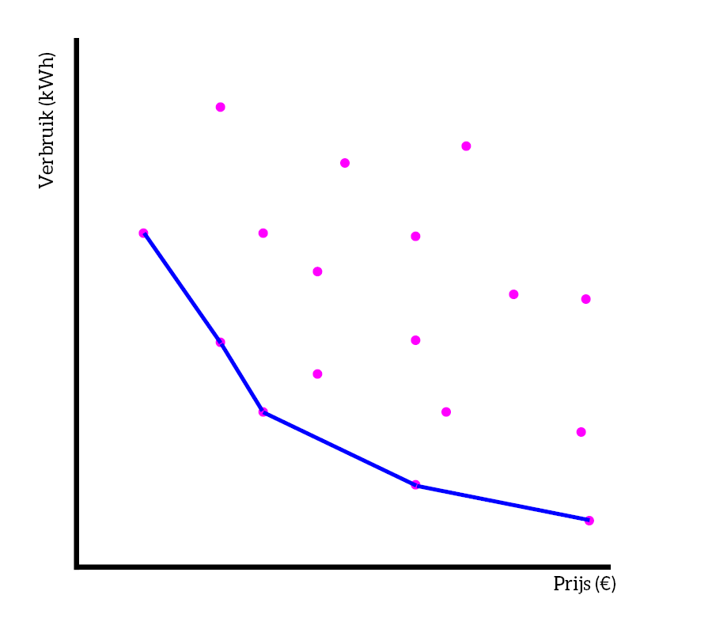

# Is there an ideal orthosis?
We now focus on two criteria. Based on these, we can create the so-called Pareto curve (a curve with a Pareto front). This is a typical engineering tool to make a decision in a situation where two criteria affect each other.

To better understand this, let's first look at the example of a refrigerator: 
Suppose we want to compare different refrigerators, each refrigerator has a price and also consumption (in kWh). When we plot the refrigerators on a graph, we see the following:

The blue line actually connects the most extreme points (a very cheap refrigerator that consumes a lot and a very expensive refrigerator that consumes little).

Based on the graph, you can also see that there are a lot of 'sub-optimal' points, or refrigerators that are not interesting to buy. Take the following example:

Refrigerator X is not ideal, for the same price we can also get a refrigerator that consumes much less. The most optimal point in this case is the point that is as close as possible to the Pareto front (the blue line).

The actual Pareto front is not a nice curve but connects the optimal points with each other. It gives you the ability to limit your attention to make an efficient trade-off, instead of looking at a full dataset and considering the full range of each parameter.
For the refrigerator, we then get the following:

These points are all feasible choices, depending on your own requirements you can choose the best one here.

## Setting up a Pareto curve for orthoses
We return to our ankle-foot orthoses. We want to make the best choice.
We need two criteria to be able to set up the Pareto curve. We choose 'price' and 'custom fit for the patient', two criteria that are important for the patient. Note that we now have to take the opposite for 'fit', because we want a low score to correspond with 'fully custom made for the patient'. In a Pareto curve, the most ideal is indeed a low price and a fully patient-custom fit (thus a low score).
|                 | **Malleloc-L** | **ROM Walker** | **M-step** | **Stabili-tri** | **EXO-L** | **B2-foot** | **Seahorse orthosis** |