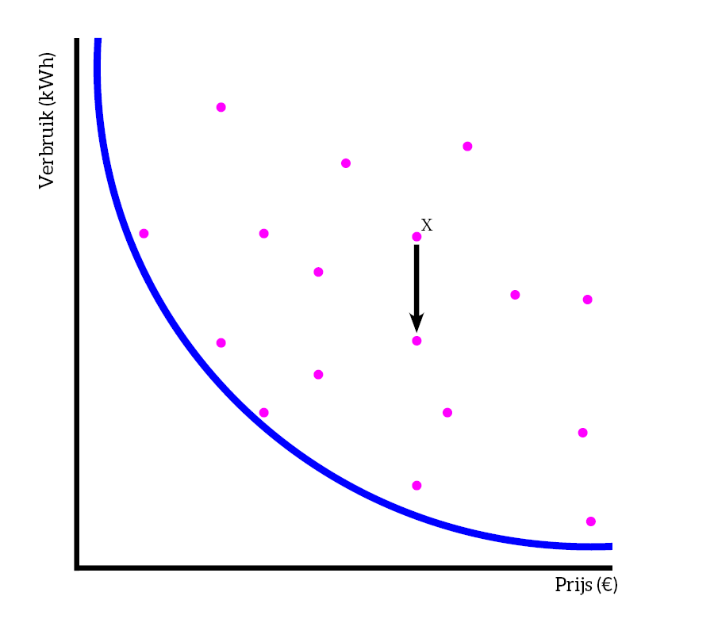
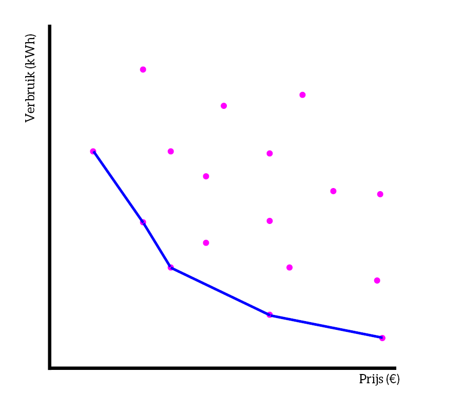

# Is there an ideal orthosis?
Let's now focus on two criteria. Based on these, we can create the so-called pareto-curve (a curve with a pareto front). This is a typical engineering tool for making decisions in situations where two criteria influence each other.

To understand this better, let's look at the example of a refrigerator:
Imagine we want to compare different refrigerators, each refrigerator has a price and also has a consumption (in kWh). If we plot the refrigerators on a graph, we see the following:

The blue line actually connects the most extreme points (a very cheap refrigerator that consumes a lot and a very expensive refrigerator that consumes little).

Based on the graph, you also see that there are a lot of 'sub-optimal' points, or in other words, refrigerators that are not interesting to buy. Take the following example:

Refrigerator X is not ideal, for the same price we could also get a refrigerator that consumes much less. The most optimal point, in this case, is the point that lies as close as possible to the Pareto front (the blue line).

The actual Pareto front is not a smooth curve but connects the optimal points with each other. It gives you the opportunity to limit your focus in order to make an efficient judgment, instead of looking at a complete dataset and considering the full range of each parameter.
For the refrigerator, we then get the following:

These points are all viable choices, depending on your own requirements you can choose the best one here.

## Pareto curve of the orthoses
Let's go back to our ankle-foot orthoses. We actually want to make the best choice.
We need two criteria to be able to establish the Pareto curve. Here we choose 'price' and 'custom-fit for the patient', two criteria that are important for the patient. Note that we now have to reverse the score for 'custom-fit', because we want a low score to correspond with 'completely custom-fit for the patient'. In a Pareto curve, the most ideal situation is indeed a low price and a completely custom fit for the patient (a low score, therefore).
|                 | **Malleloc-L** | **ROM Walker** | **M-step** | **Stabili-tri** | **EXO-L** | **B2-foot** | **Zeepaardje orthosis** |
|