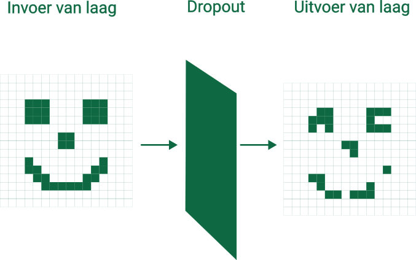

# Dropout

The **dropout** layer will set each element in the input to zero with a probability of \(p\). Below you can see an example of what the effect of the dropout layer can look like.

There are several reasons why you apply dropout.

- **Protects against overfitting**: Because you set different random pixels to zero during training each time, it will be harder for the network to memorize the training set. It therefore counteracts overfitting.
- **Redundancy in learned features**: Because you leave out different pixels each time, the network will have to learn multiple ways to recognize certain features. In effect, you create "backup rationales" to recognize certain objects.
- **Model generalizes better**: Dropout introduces random variations in the input images. As a result, the trained network can better handle images it has not seen before. 

<h2 class="title">Dropout</h2>

Dropout is only applied during the training of the network. Once the network has been trained, this layer will no longer set values to zero. 

