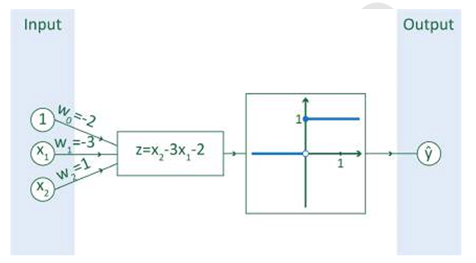

# Dense layers

Dense layers, in other words fully connected layers, are layers in which all elements in this layer are connected via neurons to all elements in the next layer. For each element in the next layer, a weighted sum is taken of the elements in the current layer, after which an activation function is applied to the result of the sum (e.g., relu). Below you see an example of such a dense layer with three input values and one output value.

