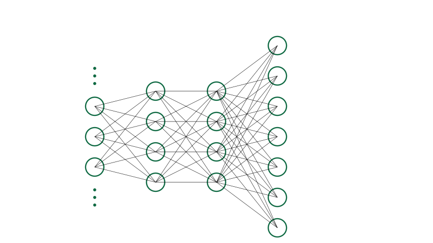
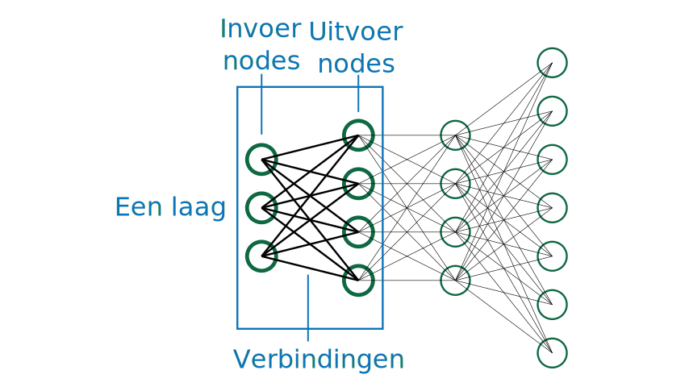

# AI-model

    <h2 class="title">Assignment</h2>
    

            On the Teachable Machine webpage there are two buttons that refer to a <strong>model</strong>. Can you find these buttons?
    

**But what actually is a model?** 
An **AI model** is a collective term for different kinds of information needed to make the AI system work. The model consists of **an architecture**, **algorithms** for training and evaluation, and the **learned parameters (the weights)**. 
An explanation of these different concepts:

* **The architecture**: The architecture defines the shape of the model. There are different types of AI models, each with their own structure. A neural network, for example, consists of a number of layers, each with its own operation. There are also other AI models, for example *random forests*. Such a model does not consist of layers, but of a collection of *trees*.
* **The learned parameters**: Besides an architecture, the model also needs values it can rely on to make a prediction. Most of the time these are just numbers. The training algorithm will ensure that the values are set in such a way that you can use the model to make predictions.
* **Algorithms**: Different algorithms are needed to work with a model. You will need an algorithm to teach the model something, but also to let the model make a prediction. A well-known algorithm used to teach neural networks is **backpropagation**. The algorithm used is closely tied to the chosen data structure.

## Architecture, parameters and algorithms

Below, by means of images, we explain what the architecture, the parameters, and the algorithm of a neural network are.

### Architecture

In the first figure you can see an example of a neural network. 

You can see that the neural network is built from different layers. Here these layers are shown from left to right. The input of the first layer will have the size of the elements of the input data. For example, an image of 220 x 220 pixels. The output of the last layer will contain the network’s prediction. All layers in between are called the hidden layers (*hidden layers*). The shape of the input, hidden, and output layers can vary greatly from neural network to neural network. The number of hidden layers also varies between different neural networks.

A **layer** consists of an input, a processing step, and an output. The input resides in the nodes (also called nodes or neurons) on the left of the layer. The processing happens based on the strengths of the connections in the layer (the weights) and a mathematical formula. The output is written to the nodes on the right of the layer. 

### Parameters (weights)

Numbers are stored in the layers. These numbers are the weights (*weights*) of the neural network; they determine the behavior of the network. During training, the computer adjusts these numbers bit by bit until they have the best possible values. With optimal values, the neural network will be good at making correct predictions. What “good” means is determined by the architect of the neural network, i.e., the human. A system that has to distinguish between cats and dogs, for example, can be labeled “good” when it makes a correct prediction 99 % of the time.

Below you can see a neural network in which the weights have been assigned values. The thicker the connection line, the larger the weight, and thus the more influence that connection has on the computations.

### Algorithms

Different algorithms are needed to make the neural network work. What matters here is that you know there are always two kinds of algorithms needed: a **training algorithm** and an **inference** or **evaluation algorithm**.

The **training algorithm** will adjust the weights in the network based on example data.

The **evaluation algorithm** will make a prediction for a new image.

    <h2 class="title">Algorithmic overlap</h2>
    

        In many AI systems such as neural networks, the evaluation algorithm is a component of the training algorithm. That’s because when training you need to know how well the model is already performing; for that, interim evaluations are needed.
    

