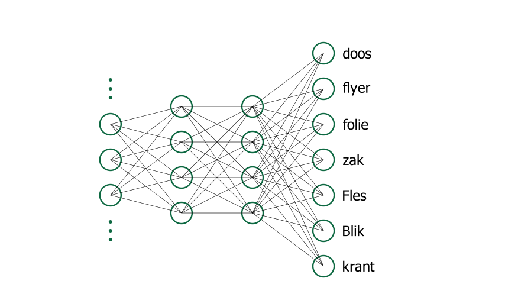

# Transfer learning

***Transfer learning*, or 'transfer learning', is a technique that lets you leverage the power of an existing AI model for a new task.**

Suppose you want to train a model that can classify waste into the categories 'Paper' and 'PMD'.  
You could start from scratch and train a completely new AI model. However, you would need quite a lot of data: this dataset would have to contain thousands of images of paper and PMD. It would therefore be a lot of work to collect these images.  
To avoid this, you can start from an existing model that someone else has already trained for a similar task. There are various models (e.g., ImageNet) that are trained to detect objects in images. ImageNet, for example, is trained on more than a million images and can classify 1,000 different kinds of objects. By starting from this model but adapting it to your task, you can achieve a good result with a limited number of images. **Specifically, this adaptation means that you add an extra layer to an existing model and then fine-tune the model.**

## Extra layer

In transfer learning you add a new layer to an existing model. For example, start from the following model:

As you can see, this model is trained to classify objects such as a box, a bottle, a bag, etc. You now add an extra layer to this model. You will train this layer to translate from object type to waste category. In other words, you will ensure that the model can predict which waste category an object belongs to.

