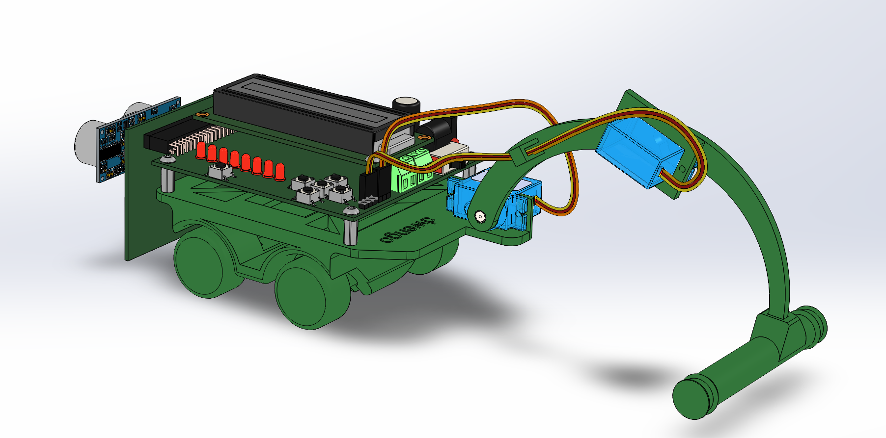
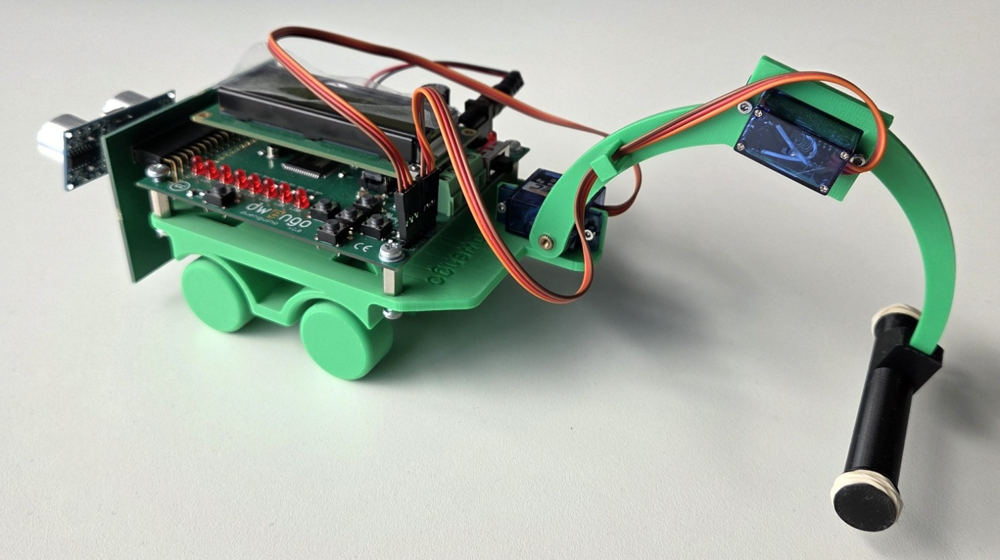

# The mechanical design

The body of the robot consists of the following components:

- the Dwenguino board;
- the 'social robot' expansion board;
- two 180° servo motors;
- a 9V battery;
- a cable to connect the 9V battery to the Dwenguino board;
- a small cart;
- four M3 screws, length 1 cm;
- four M2 screws with nut, length 1 cm;
- an arm; it consists of an upper arm, a forearm, and a scoop.
- Two rubber bands.

Below you can see a render and a photo of the assembled robot. 

Before you can build the robot, you will need to 3D print a number of parts. In the next step of this learning path we provide more information about that.