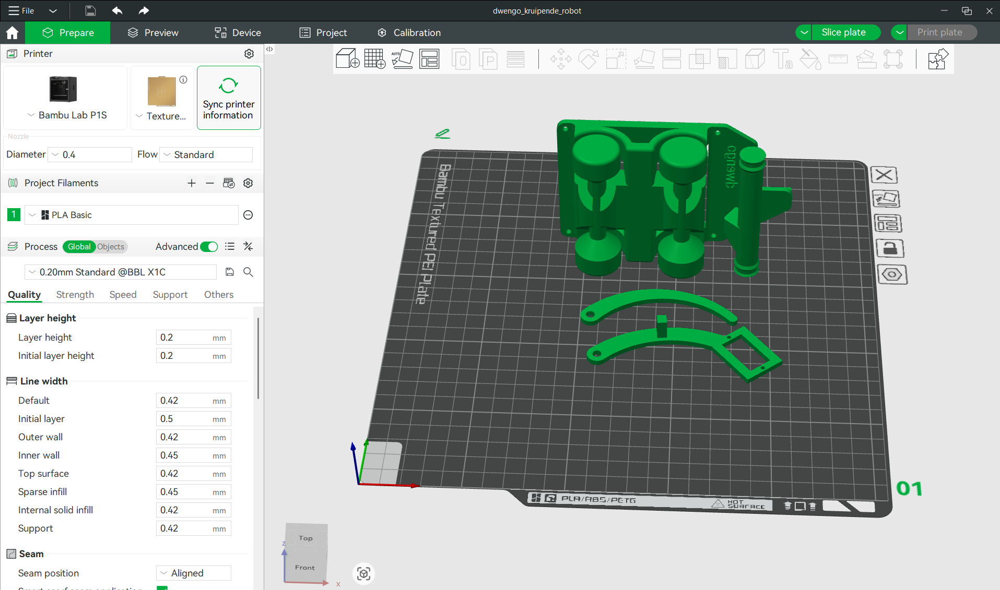

# 3D printing

Before we can build the robot, we need to 3D print a number of parts. Below we provide an overview of those parts. For each part you can find various files.

1. A .STEP file. You can open this file in most 3D printer software. It contains the information needed to print the 3D design.
2. An .STL file. In the past, 3D printer software mostly used .STL files. So if your printer does not support .STEP files, you can use the .STL file.
3. A .SLDPRT file. This is the source file of the 3D design that was created in Solidworks. If you have Solidworks and know how to use it, you can adapt the design to your own needs.

Below you can find the files to print.

- The cart ([.STEP](./final_designs/dwengo_cart.STEP), [.STL](./final_designs/dwengo_cart.STL), [.SLDPRT](final_designs/dwengo_cart.SLDPRT)).
- The first part of the arm with space for a servo motor ([.STEP](final_designs/servo_arm_met_servo.STEP), [.STL](./final_designs/servo_arm_met_servo.STL), [.SLDPRT](final_designs/servo_arm_met_servo.SLDPRT)).
- The second part of the arm ([.STEP](./final_designs/servo_arm_foot.STEP), [.STL](./final_designs/servo_arm_foot.STL), [.SLDPRT](final_designs/servo_arm_foot.SLDPRT)).
- The roller that provides more grip on the ground ([.STEP](./final_designs/servo_arm_roller.STEP), [.STL](./final_designs/servo_arm_roller.STL), [.SLDPRT](final_designs/servo_arm_roller.SLDPRT)).

## Your 3D printer software

Depending on the printer you have available, the printing process will proceed slightly differently. Still, most software follows more or less the same steps.

1. Add the parts you want to print to the build plate in the program.
2. Choose the correct settings for your print (e.g., the filament you use and the print quality). Most software nowadays has various standard profiles you can choose from so you do not have to adjust all settings individually. If your software has such a profile, choose a standard-quality print.
3. Convert the 3D design into a path that the 3D printer's head will follow. This step is also called *slicing* the model.
4. Transfer the *sliced* file to the printer. On some printers this can be done via Wi-Fi. On others you will have to remove the SD card from the printer, put your file on it, and then insert the SD card back into the printer.
5. Start the print and wait.

We printed this design with a Bambu Labs printer. Below you can see a screenshot of our slicer software.

<h2 class="title">Slicing</h2>

The software for your 3D printer is also sometimes called the <em>slicer</em>. This comes from the English verb <em>to slice</em> (cut in Dutch). The application is named after this because it will cut your 3D model into layers and, for each layer, calculate a path for the 3D printer's head. 

<h2 class="title">Assignment</h2>

Print all parts of the crawling robot on a 3D printer.

