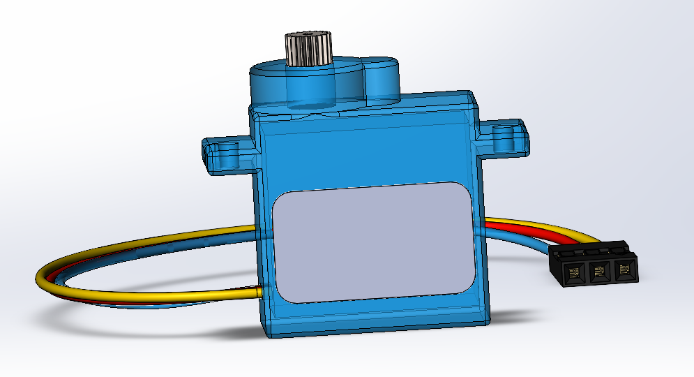
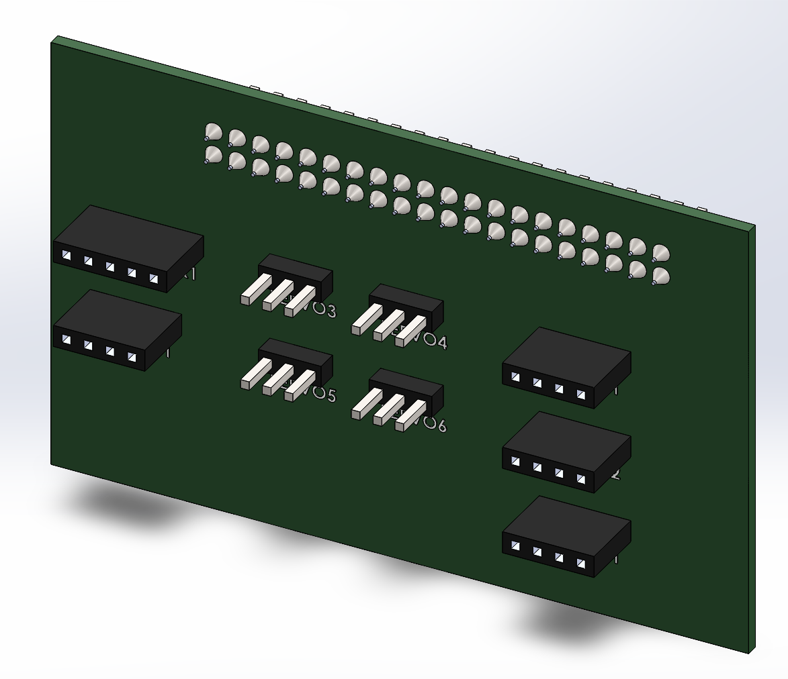
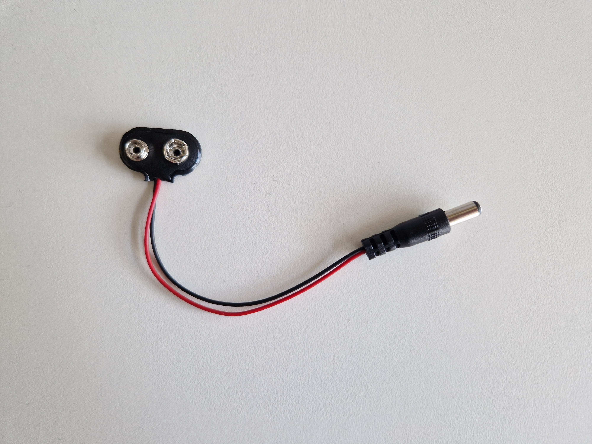
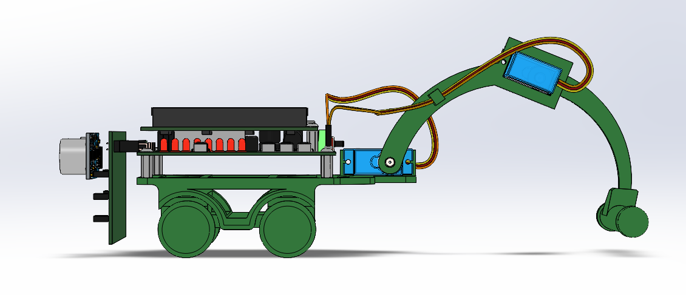

# Electronics

All the electronics you need for this robot can be found in Dwengo's 'social robot' kit. You can borrow it through your school network (ask the educational guidance service for more info) or purchase it via [dwengo.org/shop](dwengo.org/shop). For the crawling robot we need the following electronics.

<table>
<tr><td></td><td>Two FS90MG micro servo motors.</td></tr>
<tr><td></td><td>One HC-SR04 sonar sensor.</td></tr>
<tr><td></td><td>The Dwenguino microcontroller platform.</td></tr>
<tr><td></td><td>The social robot expansion board.</td></tr>
</table>

If you want your robot to drive autonomously without having to be connected to the computer, then you need a 9V battery and a small cable to connect that battery to the 5mm jack of the Dwenguino.

Connecting the electronics is relatively straightforward. You can connect the servos to the SERVO1 and SERVO2 connectors on the Dwenguino board. You can connect the sonar sensor to the SONAR1 connector on the expansion board. You will have to bend the sonar's pins 90 degrees so that the sensor does not face the ground.

<h2 class="title">Assignment</h2>

Assemble the robot. Use the listed electronics and the parts you have 3D-printed. If you use a 9V battery, make sure to place it in the enclosure before attaching the Dwenguino.

