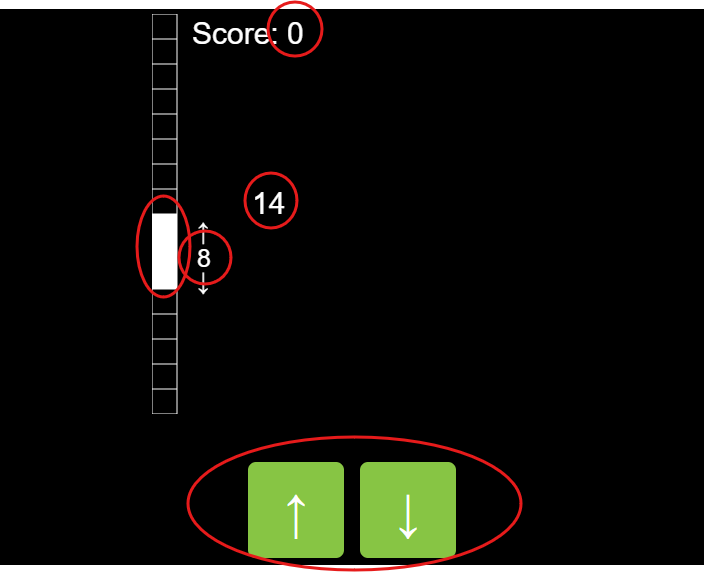
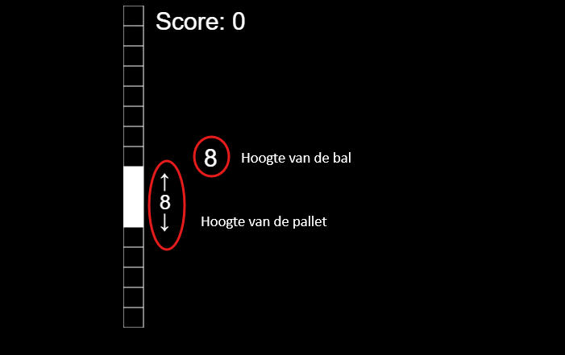

# The environment and the state

## The environment

You can see the environment as the world in which the agent can move. The world of a hamster, for example, is everything inside its cage. In our game, the environment consists of the score at the top, the three blocks (the 'paddle') on the left, the two numbers, and the buttons at the bottom. In this picture you can see the elements of the environment of our game.

## The state

An environment always has a state. The state of the environment is a snapshot of what the environment looks like at that moment. In the hamster cage, for example, the state might be that all the straw is on the right side of the cage, the food bowl is empty, and hamster droppings are scattered everywhere. At another time, for example after you've cleaned the cage, the state can be completely different: the straw is nicely spread out, the food bowl is full, and there are no droppings in the cage. 

In our game, there are really only two values that determine the state of the game: the height of the paddle and the height of the ball. The score isn't really part of the state. It only shows how much reward we've received so far.

Note that you only needed these two values to learn how to play the game. Only later in the game, when you scored more than 150 points, could you see that you were actually playing Pong. This shows that you can learn to play Pong by only looking at the height of your paddle and the height of the ball.