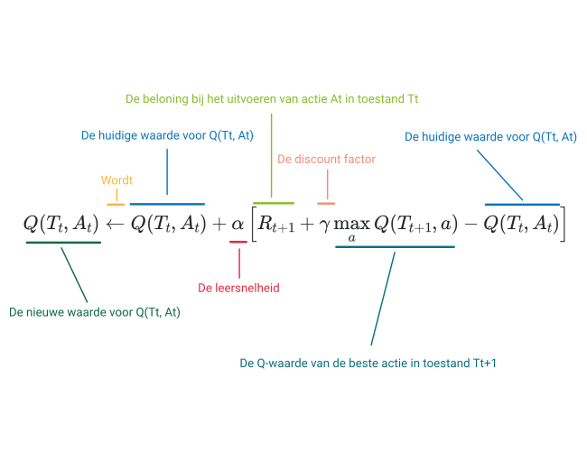

# The update rule

You now know that you can represent the \(Q\) function using a table. With the help of that table, an agent knows how to execute a policy. For example, by choosing in each state the action with the highest value. The question now, of course, is: how do we construct this table?

To construct the Q-table, we let the agent try actions and observe which reward the agent receives. Based on this reward we adjust the value in the Q-table. In this way, in each state we try to get a better estimate of the reward that each action will yield. 

## The update rule

Below we first present the formula with which we will adjust \(Q(T_t, A_t)\) when we have received a reward. Don't be overwhelmed by the formula. Later in the learning path we will provide additional explanations about this several more times.

 

Study the figure above carefully and try to understand the different components. Below you will find a more detailed explanation of the formula. 

**The update rule:**

\[
  Q(T_t, A_t) \leftarrow Q(T_t, A_t) + \alpha  \left[ R_{t+1} + \gamma \max_{a} Q(T_{t+1}, a) - Q(T_t, A_t) \right]
\]

**It consists of the following components:**

* The arrow \(\leftarrow\) indicates that we assign a new value to \(Q(T_t, A_t)\).
* This new value is the current value (\(Q(T_t, A_t)\)) plus a correction term (\(\alpha  \left[ R_{t+1} + \gamma \max_{a} Q(T_{t+1}, a) - Q(T_t, A_t) \right]\)).
* The correction term consists of the following elements:
  - \(\alpha\): A number between 0 and 1 that affects how strongly we will adjust the Q-function. \(\alpha\) is called the learning rate.
  - \(R_{t+1}\): The reward the agent receives at time \(t\) after taking action \(A_t\).
  - \(\gamma \): A number between 0 and 1 that influences how strongly the future reward will affect the current reward. \(\gamma\) is called the discount factor.
  - \(\max_{a} Q(T_{t+1}, a)\): The Q-value of the best action \(a\) in state \(T_{t+1}\) times a weighting factor \(\gamma\).
  - \(Q(T_t, A_t)\): The current Q-value in state \(T_t\) when taking action \(A_t\).