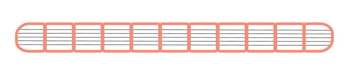
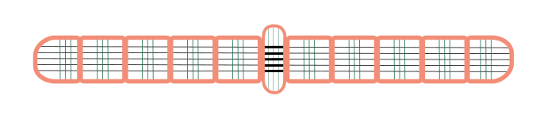
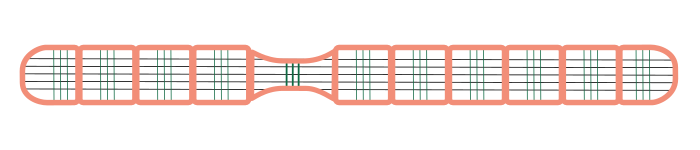

# The worm

You now know how to represent the value function using a Q-table and how to adjust the values in the Q-table based on a reward. Still, this remains quite abstract. Therefore, we will get to work with a concrete example. In this example, we will teach a virtual worm to crawl using reinforcement learning. 

## How does a worm crawl?

You’ve surely come across a worm when you were digging in the garden. Have you ever stopped to think about how such a worm moves underground? That’s not so straightforward, since worms don’t have legs. Imagine we wrap you in duct tape and bury you in the ground—could you still move?

### The morphology of a worm

The structure and shape of an organism are called the morphology of that organism. This morphology enables the worm to move underground. 

**Segments**

A worm is composed of separate segments that are filled with fluid.

**Muscles**

Longitudinal muscles run along the length of the worm.

In addition to the longitudinal muscles, the worm also has circular muscles that run around the body of the worm.

**Bristles**

There are also small bristles on the worm’s body. These give the worm more grip on the surrounding soil.

### The movements of the worm

The worm can move each segment in two possible ways.

**Contracting the longitudinal muscles**

By contracting the longitudinal muscles in a segment, the length of the segment becomes shorter. Because the segment is filled with fluid and fluid is incompressible, this causes the outside of the worm to expand due to the pressure.

**Contracting the circular muscles**

Conversely, by contracting the circular muscles in a segment, the circumference of the segment becomes smaller. As a result, the segment will become longer due to the pressure.

**Locomotion**

A shortened segment increases the pressure on the soil around the worm. The bristles on the worm therefore grip the soil at that spot. An expanded segment makes the worm longer and thinner; as a result, there is less friction with the surrounding soil and that part can move forward and backward more easily.

By contracting and relaxing the longitudinal and circular muscles in the right pattern, the worm can move forward. It is this pattern that we will try to teach a virtual worm using reinforcement learning.

<h2 class="title">Bio-inspired robotics</h2>

Bio-inspired robotics is a research field in which engineers draw inspiration from nature to develop innovative technologies. A nice example of this is research into the remarkable muscle architecture of the seahorse’s tail. This tail is able to grip objects such as seaweed firmly, thanks to a unique combination of long muscles that span multiple vertebrae and shorter, segmental muscles. By modeling this biological design in simulations and physical robots, researchers have shown that this muscle structure converts forces into motion more efficiently while simultaneously enabling robust gripping functions. Such insights not only offer a better understanding of evolutionary adaptations, but also form the basis for designing new, flexible robotic arms that can be used, for example, in medical or maritime applications.

