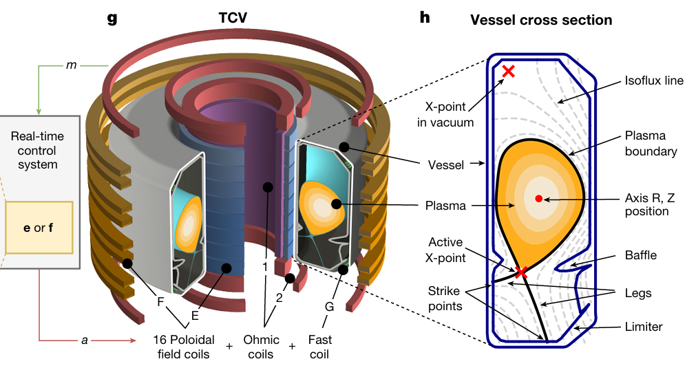

# Pong

In this learning path you saw how to train a worm to crawl using reinforcement learning. Reinforcement learning can be applied in many contexts. Think back to the Pong game from the previous learning path. We can also train an agent for that game. That agent will then try to play the game. 

Below you can train an agent to play the Pong game. As with the worm, adjust the parameters of the training process until you get a good result. Follow the instructions below.

1. Set the parameters of the learning process.
2. Press the **Train** button. The AI agent will now try to learn to play the game. To do this, it plays against an optimal player who never makes mistakes. The learning happens behind the scenes, so you don't see how it proceeds.
3. Review the performance. When the agent has finished learning you will see it play a game against the optimal player. The AI agent plays on the left, the optimal player on the right. 
4. Repeat steps 1, 2, and 3 until the AI agent performs well against the optimal player.
5. Challenge the AI agent yourself. When you think the AI agent is good enough, you can play against the agent yourself. To do so, press the **Play against the AI** button. 

<iframe src="https://dwengo.org/pong" title="Example of a convolution" width="720px" height="800px"></iframe>

<h2 class="title">Reinforcement learning and nuclear fusion</h2>

In nuclear fusion, hot plasma of more than 150 million degrees Celsius must be kept suspended using electromagnets. These magnets must at every moment generate the correct magnetic field to keep the plasma suspended. To do this, complex control signals must be sent to the magnets. Jonas Degrave, a researcher at Google DeepMind and an alumnus of the AI and Robotics Lab at Ghent University (UGent), developed such a control system that uses reinforcement learning1. He published his work in the journal Nature.

</img>  

1. Degrave, Jonas, et al. "Magnetic control of tokamak plasmas through deep reinforcement learning." Nature 602.7897 (2022): 414-419.>

