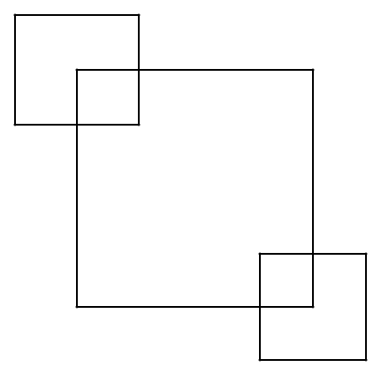
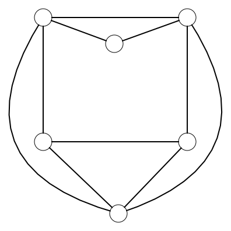
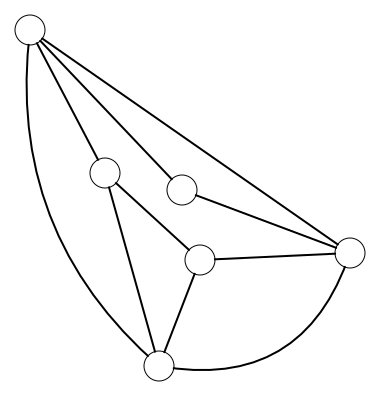

# Graphs

Did you manage? Were you able to make all the drawings without lifting your ballpoint pen? Or did some figures not work out for you? For many drawings it can be very difficult to find a solution by simply trying out possibilities. Yet there is a trick that can help you find the solution more easily. This trick comes from graph theory. 

<h2 class="title">What is a graph?</h2>

A graph is a structure that consists of <strong>nodes</strong> and any connections between those nodes, the <strong>edges</strong>.

Here you see an example of a graph with **two nodes** and **one edge** between them.

The drawings we tried to make can also be represented as graphs. In the following table you see the drawing on the left and the representation as a graph on the right.

| Drawing | Graph |
|-|:-:|
|  |  |
|  |  |
|  |  |
|  |  |

Our initial problem, in which we want to make a drawing without lifting our ballpoint pen, can thus be translated into a graph problem. We formulate this problem as follows. Does there exist a *walk* in the graph in which you traverse each edge exactly once?

    <h2 class="title">Isomorphism</h2>
    

        Unlike our drawings, the positions of the nodes of the graph are not important. You can draw the nodes of the graph anywhere as long as they remain connected via edges to the same nodes. These different versions of the graph are <strong>isomorphic</strong>. Below you can see, for example, a number of possible graph representations for the house.
        <table>
            <tr><td></img></td></tr>
            <tr><td></img></td></tr>
            <tr><td></img></td></tr>
            <tr><td></img></td></tr>
        </table>
    

<h2 class="title">The Mercedes challenge</h2>

<table>
<tr>
<td></td>
<td>
The Mercedes challenge is a puzzle that went viral on TikTok. The challenge is said to have started at a Mercedes dealership in Dubai. There, a large Mercedes logo was drawn on the floor. Visitors to the dealership were challenged to walk along all the lines of the logo without walking over the same line twice. When they succeeded, they won a car. 
</td>
</tr>
</table>

Go find a video of the <em>Mercedes Challenge</em> yourself. Can you manage to walk over the lines of the logo in the correct way?

**Why is it useful to represent our drawings as graphs?**

A graph is an abstract representation that we can use for many problems. That is why many clever mathematicians and computer scientists have already thought about the properties of those graphs. We can use their knowledge to solve our drawing problem.

You might not expect it, but our drawing problem closely matches the problem of the Seven Bridges of Königsberg.