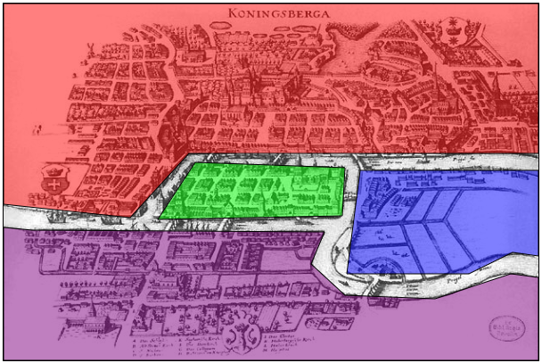

# Graph of Königsberg

To solve this problem, we can first create an abstraction of the city's map. After all, there is a lot of information on it that we don't need. For example, we don't need to know where the houses in the city are, or even exactly where the river and the bridges are located. The only information we need is which islands there are and which bridges connect the islands. We omit the superfluous information.

We draw a **graph** of the city as follows:

1. Draw a vertex for each island of the city.
2. Draw, for each bridge between two islands, an edge between the vertices corresponding to those islands.

Below you can see the map of Königsberg where each island has been given its own color. Below that you can see the corresponding graph. The color of the vertex corresponds to the color of the island.

You may already notice this, but this problem is identical to the one where we had to make a drawing without lifting our pen. Does there exist a walk in the graph in which you cross each edge (bridge) exactly once?

Such a walk is called an Eulerian path. If such a path starts and ends at the same vertex, then we call it an Eulerian circuit.