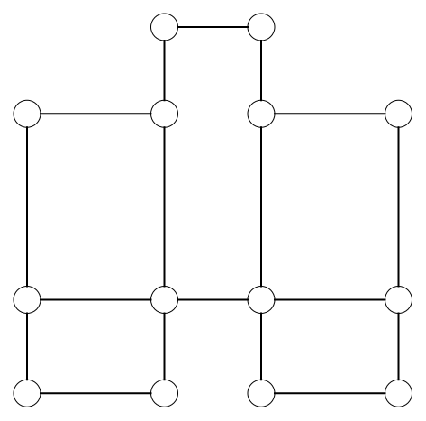

# Eulerian path

Leonhard Euler solved the Seven Bridges of Königsberg problem in 1736. Euler stated that a *walk* in the graph in which you cross each edge exactly once is only possible if:

 **Every vertex in the graph has an even number of edges, or there are exactly two vertices with an odd number of edges**.

Euler based his theorem on two observations:
1. If you have a graph in which every vertex has an even number of edges, you can never get stuck at a vertex other than the one where you started. This follows directly from the even number of edges of each vertex. If you arrive via one edge, there is always another to depart by. Otherwise, the number of edges would not be even.
2. If you have a graph with two vertices with an odd number of edges, you must start at one of the vertices and end at the other. For the other vertices, observation 1 applies, so you cannot get stuck.

<h2 class="title">Assignment</h2>

Count the number of edges leaving each vertex (= the degree of the vertex) of the Königsberg graph. Is it possible to find an Eulerian path in the graph?

</img>

<h2 class="title">Assignment</h2>

Look back at the following drawings. Which of these drawings can you draw without lifting your ballpoint pen, and which cannot?

<table>
  <tr>
    <th>Image Number</th>
    <th>Image</th>
  </tr>
  <tr>
    <td>1</td>
    <td></td>
  </tr>
  <tr>
    <td>2</td>
    <td></td>
  </tr>
  <tr>
    <td>3</td>
    <td></td>
  </tr>
  <tr>
    <td>4</td>
    <td></td>
  </tr>
</table>

